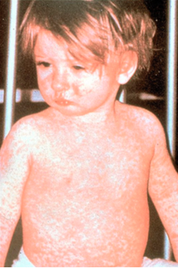
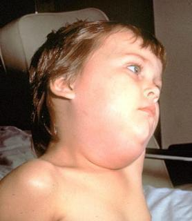
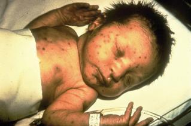

```{r setup, include=FALSE}
knitr::opts_chunk$set(echo = FALSE)
knitr::opts_chunk$set(fig.pos = 'H')
```

This project represents a line of theoretical and empirical work seeking to understand misconceptions and belief revision in the context of people’s intuitive theories. We focus our efforts on reducing vaccine skepticism by identifying people’s intuitive theories surrounding vaccination decisions. Through this case study we hope to shed light on why such misconceptions persist and how educators and interventionists might address misconceptions more effectively across domains. We argue that correcting misconceptions requires presenting evidence in a way that is sensitive to and persuasive within the broader conceptual context in which those misconceptions reside [see @gershman2019; @weisman.markman2017]. Understanding the revision of any one specific belief (e.g., a misconception like _vaccines are dangerous_) demands a holistic understanding of the wider set of related beliefs that make up people's intuitive theories.

First, we describe in further detail the modeling process for developing a Bayesian network model of the intuitive theory surrounding vaccination decisions.

Then, we describe our empirical methods in detail. This begins with the qualitative research we conducted with vaccine skeptics to develop psychometrically-valid quantitative scales measuring a network of 14 beliefs related to vaccine skepticism. Then, we report the detailed methods for each of the empirical studies reported in the paper. In Study 1, we used Bayesian network structure learning algorithms to develop a cognitive model of the relationships among these beliefs in a large sample of people. This model can predict how beliefs correlate across people and how they would be revised in the face of evidence. In Study 2, we replicated the success of an existing intervention emphasizing the dangers of childhood diseases [@horne.etal2015] and used our model to provide a more detailed understanding of _how and why_ this intervention increases vaccine intentions. In Study 3, we drew inspiration from our model to create and validate the success of  a novel intervention aimed at debunking concerns about toxic additives. Finally, in Study 4 we tested whether people's beliefs changed coherently following relevant real-world events, by examining beliefs before and after serious outbreaks of measles in the United States in early 2019.

# Modeling

## Bayesian network parameterization

Figure 1 shows an example of a simple Bayesian Network. The network itself is a _directed acyclic graph_ (DAG), a type of graphical model. Graphical models represent variables as nodes connected by edges. In a DAG, these edges are directed, flowing from parent to child, and are constrained so that they cannot form cycles or loops. In a Bayesian network, these directed edges encode conditional dependencies among variables, so that the conditional probability distribution for a given variable is defined only in terms of its direct parents. Together, a child node and its parents are called a _family_.

```{r fig1-dag-example, echo=F, message=F, warning=F, fig.align='center', out.width = '40%', fig.cap="Example DAG illustrating some variables related to wildfires."}

library(DiagrammeR)
library(DiagrammeRsvg)
library(rsvg)

grViz(
  diagram = "
  digraph causal {

	  # Nodes
	  node [shape = oval]
	  D [label = 'Dry']
	  H [label = 'Heat']
	  F [label = 'Fire']
	  S [label = 'Smoke']


	  # Edges
	  edge [color = black,
	        arrowhead = vee]
	  rankdir = LR
	  D->F
	  H->F
	  F->S

	  # Graph
	  graph [overlap = true, fontsize = 8]
	}"
)
```

In this graph, the edge $FIRE \rightarrow SMOKE$ captures that fire causes smoke.^[The example of cause and effect is especially intuitive, but these edges need not be causal. Instead, they are better thought of as representing “influence relations”, which may also include relationships like logical implication and set membership [@williamson2001].] This relationship is represented as a probabilistic function, where the probability of smoke depends on the probability of fire. The probability of a node Y can be defined from its parents X in many different ways. For binary nodes, the most flexible specification is a conditional probability table (CPT) with 2^n^ entries specifying the probability of Y given the entire joint probability distribution over X, where n is the number of parents X. Given the exponential complexity of the CPT, simpler functions are often used to specify the probability of the child node, such as the noisy-or and noisy-and-not functions. A noisy-or function assumes each of the parents are independent generative forces, each with a probability of generating the effect. A noisy-and-not function assumes each of the parents are independent preventive forces, specifying the probability of the child node as the probability that it is generated _and not_ prevented by any one of its possible preventers. We construct our cognitive model parameterization using a combination of these two functions, using a distribution sometimes referred to as a “DeMorgan gate” [@maaskant.druzdzel2008]. In our model, the probability of the child node Y can be expressed as:

$$P(y) = \Big(1-(1-w_0)\prod_i(1-w_i)^{x_i}\Big)\prod_j(1-w_j)^{x_j}$$

Here, each parent is either a generative (i) or preventive (j) influence, that generates or prevents the child node with probability weight $w_i$ or $w_j$. The weight $w_0$ represents the “leak” probability, or the baseline probability that the child occurs without any other generating influences. The first term in brackets represents the probability that y is generated, or alternately, that not all of the possible generating forces fail to generate it. The second term represents the probability that it is not then prevented, or that all the preventing forces fail.

A cognitive model composed of these types of relations is capable of capturing a causal system of non-interactive generative and preventive causes. Although people’s intuitive theories are likely more flexible than this, there is ample evidence that people are highly capable of reasoning according to these types of causal relationships [see @holyoak.cheng2011 for a review], and moreover, that their causal learning is strongly biased toward learning these kinds of relations [e.g. @novick.cheng2004].

This gives us a formalism for representing relations within an intuitive theory. Now we need methods for estimating the relationship that are actually represented within people’s intuitive theories. Given measures of participants’ credences in each of the parent beliefs $x_i$ and the child belief $y$, we assume the following beta regression model:

$$y \sim beta\big(\mu k, (1-\mu)k\big)$$
$$\mu = \exp\Bigg(\ln\Big(1 - \exp\big(\ln\big(1-w_0) + \sum_i(1-w_i)x_i\big)\big) \Big) + \ln\Big(\sum_i(1-w_i)(1-x_i)\Big)\Bigg)$$

Via maximum likelihood estimation, we estimate for each parent a discrete parameter $x_i$ determining whether the relationship is generative or preventive, and a continuous weight $w_i$ determining its strength. We also estimate $w_0$, the “leak probability” which is assumed to be generative, and $k$, a measure of dispersion in the responses $y$.


## Structure learning

Where the structure of an intuitive theory is known, Bayesian networks offer powerful tools for predicting and understanding how evidence will affect people's beliefs. However, there are many cases where the structure of the intuitive theory is unknown and is itself the very question under investigation.

Fortunately, the formalism of Bayesian Networks provides tools for navigating these challenges. Here, we used Bayesian network structure learning algorithms to construct a model of the intuitive theory of vaccine decisions (see Scutari & Denis, 2021). One way to learn a Bayesian network structure from data is to search through a space of networks, “score” each and choose the best scoring network. Many scoring metrics are possible, but a directly meaningful one is p(d|G), the likelihood of the data given the graph structure. Asymptotically, this can be estimated using the Bayesian Information Criterion (BIC) (citation):

$$BIC = k \ln (n) - 2\sum_{i}\hat{\ell}(x_i|x_{va(x_i)})$$

Which we estimate using the maximum log-likelihood estimated for our statistical model, calculated as the sum of the maximum log-likelihood for each node given its parents, from a total of $k$ parameters and $n$ data points.

### Generative model principle

We constrained our search by applying what we call the “generative model principle”, assuming that the intuitive theory is a generative model, so that influence relations (edges) should flow from “generating” states of affairs toward states of affairs that result, such as from cause to effect.

We used “abstractness” as a heuristic for constraining structure learning according to the generative model assumption: We assume that abstract states of affairs generate more specific and concrete states of affairs, so that edges should flow from the abstract toward the concrete. For instance, an abstract belief, such as the belief that natural things are better than artificial things, could influence more concrete beliefs, such as the belief that vaccines are dangerous. We consider “naturalism” to be an abstract belief because it is a belief about two large classes of entities, “natural things” and “artificial things”. The belief that vaccines are dangerous is relatively more concrete: the class of “vaccines” is relatively smaller and largely subsumed by the class of “artificial things.” Here, what is true of a larger class influences what we should think about the more specific class.

Before constructing our model, we sorted the 14 measured beliefs into “tiers” based on how broad or abstract each belief was. For instance, we considered holistic balance and naturalism to be the most abstract beliefs among those we measured, and labeled these “worldviews”; we considered our outcome of interest, vaccine intentions, to be the most concrete measurement of a specific intended action. In between, we judged “medical skepticism”, “parental protectiveness”, and “parental expertise” to be more general than beliefs about diseases and vaccines, and so separated these into two tiers as well. We then applied the generative model principle to induce a partial-ordering of these beliefs, and a corresponding “blacklist” stipulating that certain edges must not appear in the final DAG. For instance, that there is no edge from vaccine intentions to naturalism. This constraint can be thought of as a strong prior over the possible structures of this intuitive theory (namely, $P(G)=0$ for any graph $G$ not respecting the principle).

### Cross validation of structure learning results

To conduct an efficient search through the super-exponential space of DAGs, we tested several variants of two structure learning algorithms implemented in the “bnlearn” R package [@scutari2010]. The first is a purely score-based “hill-climbing” algorithm(HC) and the second was a hybrid algorithm that combined the hill-climbing algorithm with a prior “restriction” phase that pruned down the space of DAGs (MMHC). This pruning was accomplished with the “min-max parents and children” algorithm, which can be tuned with a hyperparameter alpha, which we tested at several levels. To speed computations, we restricted the maximum number of parents in the graph to five for all nodes, as the complexity of the scoring function is exponential in the number of parents. In all resulting networks no node was found to have more than four parents, suggesting this did not impact the final results.

We performed a series of 10-run 10-fold cross validation analyses to evaluate the success of these different structure learning strategies. In addition to the different algorithms, we also compared four different “blacklists” that imposed different constraints on the structure learning process. In addition to our theory-driven blacklist based on our generative model assumptions ("theory"), we also explored unconstrained structure learning, and two additional blacklists: one which stipulated only that “intentions to vaccinate” should be a child node with no children of its own ("child"), and another that stipulated also that the most abstract beliefs “holistic balance” and “naturalism” should be allowed to have no parents other than each other ("parents").

Figure 2 displays the results of these cross-validation tests. As seen in the figure, all structure learning approaches produced models with similar out-of-sample performance, with more variability among folds and runs than between algorithms. Thus the cross-validation does not uniquely identify an optimal structure learning strategy.

```{r s1_load, include=FALSE}
source("../code/load-data-s1.R", chdir = TRUE)

library(tidyverse)
library(brms)
library(bnlearn)
library(HydeNet)
library(parallel)

source("../code/custom-structure-learning/cog-model-main.R", chdir = TRUE)
source("../code/graph-model-tools.R")
source("../code/custom-structure-learning/cog-model-jags-tools.R")
source("../code/custom-structure-learning/cog-model-estimate-evid-ratio.R")
source("../code/custom_plotting.R")
d_bn_scaled <- d_bn %>%
 mutate_all(function(x){rescale_beta(x,-3,3)})

## set the seed to make your partition reproductible
set.seed(123)
trainInd <- sample(seq_len(nrow(d_bn_scaled)), size = floor(nrow(d_bn_scaled)*.80))

train <- d_bn_scaled[trainInd, ]
test <- d_bn_scaled[-trainInd, ]
```

```{r load_data, include=F}
suppressWarnings(suppressMessages(source("../code/load-data-s2.R", chdir=TRUE))) # dplyr being too verbose
source("../code/load-data-s3.R")
source("../code/load-data-s4.R")
```


```{r fig2-cross-validation, echo=FALSE, fig.align='center', fig.height=3, fig.width=4, fig.cap="Cross-validation performance for diffrent structure learning algorithms on the training data from Study 1."}

if (!file.exists("../outputs/cv-res.rds")){
  source("../code/custom-structure-learning/fit-cog-models-bnlearn.R", chdir=TRUE)
} else {
  cv_res <- readRDS("../outputs/cv-res.rds")
}


cv_res %>%
  mutate(algo = case_when(
    algo == "hc" ~ "HC",
    algo == "mmhc_05" ~ "MMHC .05",
    algo == "mmhc_01" ~ "MMHC .01",
    algo == "hc_intentdv" ~ "HC (child)",
    algo == "mmhc_intentdv_05" ~ "MMHC .05 (child)",
    algo == "mmhc_intentdv_01" ~ "MMHC .01 (child)",
    algo == "hc_idv_abspar" ~ "HC (parents)",
    algo == "mmhc_idv_abspar_05" ~ "MMHC .05 (parents)",
    algo == "mmhc_idv_abspar_01" ~ "MMHC .01 (parents)",
    algo == "hc_theory" ~ "HC (theory)",
    algo == "mmhc_theory_05" ~ "MMHC .05 (theory)",
    algo == "mmhc_theory_01" ~ "MMHC .01 (theory)"
  )) %>%
  ggplot(aes(x=reorder(algo, loss), y=loss)) +
  geom_boxplot(fill="skyblue") +
  coord_flip() +
  labs(y = "Log-likelihood loss", x = "Algorithm") +
  theme_bw() +
  theme(panel.grid = element_blank())

```

Nevertheless, there were substantial differences among the approaches, especially from the application of different constraints through blacklists. In particular, structure learning conducted without any constraints produced a very different model than structure learning under the generative model constraints; although many edges were shared, the directions of these edges were very frequently reversed. For instance, in structures learned without constraints, vaccine intentions is very frequently a parent node with many children, rather than a child of other nodes. These findings underscore the need for top-down constraints in the use of structure learning algorithms to identify plausible cognitive models for relations among beliefs. Models identified without these constraints may serve fine for prediction, but appear unlikely to lend themselves to clear interpretations as cognitive models.

Without any clear guidance from cross validation and with a clear need to apply top-down constraints, we elected to advance our modeling with a model learned with the hill-climbing algorithm and our generative model constraints. This model contained more arcs than models estimated with hybrid algorithms, but because these hybrid algorithms include a restriction phase based on correlations rather than our statistical model, we preferred the unrestricted approach.

## Interpreting the model

We used a bootstrapping procedure to estimate the confidence in each of the links in this model, conducting the structure learning procedure repeatedly for 200 bootstrapped resamples of the original training data. Figure 3 visualizes the frequency with which each arc appeared in the resulting model across these replicates, and Figure 4 visualizes the model with the coefficients for each link encoded by color.

```{r fit_main_model, include=FALSE, cache=TRUE}
set.seed(73566)

theory_bl <- tiers2blacklist(
  list(
    c("hb","nat"),
    c("medSkept", "overpar", "parentExpert"),  # idk if overparenting makes sense here
    c("diseaseRare","diseaseSevere","vaccEff","vaccTox","vaccStrain",
      "vaccDanger","infantImmLimCap","infantImmWeak"),
    c("vaccIntent")
    )
  )

# this is the favorite son (most likely)
main_model <- hc(train, blacklist=theory_bl, score="custom", fun=cog_model_score_func, maxp=5, max.iter=1e3, restart=5)
```

```{r, include=FALSE}
# # can bootstrap strength of arcs for winning model approach, focus interpretations on strength of arcs / parameterizations

set.seed(77267)

# train_noise <- train %>%
#   mutate_all(~.x+rnorm(n(),0,.002))
if (!file.exists("../outputs/boot-res.rds")){
  cl = parallel::makeCluster(detectCores(logical=TRUE))

  clusterCall(cl,
              function(){
                source("../code/custom-structure-learning/cog-model-main.R", chdir=TRUE)
                library(purrr)
                }
    )

  ## very slow!
  boot_res <- boot.strength(
    train,  #train
    R = 500,
    algorithm = "hc",
    algorithm.args = list(score="custom", fun=cog_model_score_func, blacklist = theory_bl, maxp=5, max.iter=1e4),
    cluster = cl
    )

  stopCluster(cl)

  saveRDS(boot_res,"../outputs/boot-res.rds")
} else {
  boot_res <- readRDS("../outputs/boot-res.rds")
}

```

```{r, echo=F, include=F}
## examine bootstrapping results

## which arcs are most likely?
boot_res %>%
  filter(strength > .80, direction > .5)

## what is strength of each arc in final graph?
bnlearn_to_df(main_model) %>%
  left_join(boot_res, by=c("from","to"))  %>%
  filter(strength > .95)
```

```{r, include=F}

source("../code/custom_plotting.R")

recode_nodes <- function(x){
  recode(x,
         "diseaseRare" = "Disease Rarity",
         "diseaseSevere" = "Disease Severity",
         "hb" = "Holistic Balance",
         "infantImmLimCap" = "IIS: Limited\nCapacity",
         "infantImmWeak" = "IIS: Weakness",
         "medSkept" = "Medical\nSkepticism",
         "nat" = "Naturalism",
         "overpar" = "Parental\nProtectiveness",
         "parentExpert" = "Parental\nExpertise",
         "vaccDanger" = "Vaccine\nDanger",
         "vaccEff" = "Vaccine\nEffectiveness",
         "vaccIntent" = "Vaccination\nIntentions",
         "vaccStrain" = "IIS: Vaccines\nStrain",
         "vaccTox" = "Vaccines\nToxicity"
         )
  }


map_to_viridis <- function(vec, bins=64, option="D"){

  binned <- cut(vec, bins)
  levels(binned) <- viridis::viridis(bins, option=option)

  return(as.character(binned))
}


map_to_brewer <- function(vec, bins=11, option="RdYlBu"){
  binned <- cut(vec, bins)
  levels(binned) <- RColorBrewer::brewer.pal(bins, name=option)

  return(as.character(binned))
}

```

```{r boot_strength_plot, include=F, fig.width=5, fig.height=8}
#
hyde_str <- df_to_hyde_string(boot_res %>% filter(strength>.2, direction>0) %>% select(from,to))
h2 <- HydeNetwork(as.formula(hyde_str))
# plot(h2)

z2 <- custom_plot.HydeNetwork(h2, attr_theme="tb")

boot_res %>%
  filter(direction>0, strength>.2) %>%
  # filter(parameter!="phi",parameter!="w_leak") %>%
  # rename(from = parameter) %>%
  # mutate(from = gsub("w_","",from)) %>%
  mutate(strength = strength*direction) %>%
  select(to, from, strength) %>%
  merge(z2$nodes_df %>% rename(from = label) %>% select(id, from), by="from") %>%
  mutate(from = id) %>%
  select(-id) %>%
  merge(z2$nodes_df %>% rename(to = label) %>% select(id, to), by="to") %>%
  mutate(to = id) %>%
  arrange(to,from) -> edge_df_mod


# z$nodes_df
z2$nodes_df <- z2$nodes_df %>% mutate(label = recode_nodes(label))
z2$nodes_df$fontname <- "Helvetica"
z2$nodes_df$shape <- "ellipse"
z2$nodes_df$fillcolor <- ifelse(z2$nodes_df$label=="Vaccination\nIntentions",
                                "#dcdcdc","white")
z2$nodes_df$fillalpha <- 0.1
z2$nodes_df$fixedsize <- FALSE
z2$edges_df$penwidth <- abs(edge_df_mod$strength)*2
z2$edges_df$penwidth <- 1.5
# z$edges_df$label <- round(edge_df_mod$value,2)
# z$edges_df$color <- ifelse(edge_df_mod$value > 0, "blue","red")
z2$edges_df$color <- map_to_brewer(edge_df_mod$strength, bins=9, option="RdPu")
# z2$edges_df$color <- map_to_viridis(edge_df_mod$strength, option="magma")
#
render_graph(z2)

export_graph(z2, "../outputs/boot-graph.pdf")
```

```{r, include=F}
boot_graph_legend <- (tibble(
  Probability = seq(min(edge_df_mod$strength), max(edge_df_mod$strength), length=11),
) %>%
  ggplot(aes(y=1, x = Probability, fill = Probability)) +
  geom_tile() +
  scale_fill_distiller(palette="RdPu", direction=1)
) %>%
  cowplot::get_legend()

cowplot::save_plot("../outputs/boot-graph-legend.svg", boot_graph_legend)
# cowplot::ggdraw(boot_graph_legend)
```


```{r fig3-disp-bootgraph, echo=F, fig.width=8, fig.height=5, fig.cap="Bootstrapped confidence estimates for Bayesian network edges. Edge color indicates frequency with which edges appeared when conducting search across 200 bootstrap replicates. Only edges appearing in at least 20\\% of graphs are shown. Our primary outcome of interest, vaccination intentions, is highlighted in gray."}

## assemble bootstrapping graph and legend into pdf and display here
knitr::include_graphics("../outputs/boot-combined.pdf")
```


Though we found the uncovered network structure to be quite revealing and informative, there are also some important limitations that should be acknowledged. In particular, the edges from the vaccine danger and vaccine effectiveness nodes to the _vaccine toxicity_ node strike us as counterintuitive. Intuitively, we might imagine that vaccines having toxins could cause them to be dangerous and ineffective. Yet the edges in the model run from in the opposite direction, and so do not support a clear causal interpretation.

A Bayesian network is a factorized representation of a probability distribution and any given network is a member of a "Markov equivalence class"—a set of networks capable of factorizing the same distribution. This set of DAGs can be represented as a "completed partially directed acyclic graph" (CPDAG), a graph with both directed and undirected edges. The equivalence class for our model can be represented as a CPDAG with 14 directed edges and 15 undirected edges—indicating that the data do not constrain the directions of 15 of the edges in the final model. However, 10 of these edges’ directions are directly constrained by our top-down "generative model" constraints, which in turn constrains all but two of the remaining undirected edges, including the counterintuitive edges running toward _vaccine toxicity_. This is also reflected in a bootstrapping analysis applying our chosen structure learning algorithm against 1000 bootstrapped replicates of our data. We found that the direction of some edges within the graph differed across bootstrapped runs (Holistic balance $\rightarrow$ naturalism, medical skepticism $\rightarrow$ parental expertise), but that these relationships surrounding _vaccine toxicity_ were robust.

Altogether, these findings might be seen as demonstrating the need for a heavier hand in establishing top-down constraints on the model fitting. Certainly, they call for caution in interpreting the relationships represented in this model. Due to their tight connections with structural causal networks, it is tempting to interpret the edges in Bayesian networks as “causal.” However, these relationships are best thought of as probabilistic dependencies or “influence” relations [@williamson2001]. Indeed, there are other cases where it is unclear if an edge should be directed at all: e.g., it is not obvious to us what would be the “correct” direction for the edge between naturalism and holistic balance. We might even speculate there is an additional unmeasured variable that connects these beliefs and that would best account for their association. Ultimately, this model should be understood as offering a plausible, but not definitive, account for a cognitive model connecting these different beliefs.

```{r, include=F}
## explore cpdag

main_cpdag <- cpdag(main_model)


# there are 15 undirected edges, here's a plot
plot(main_cpdag)

# CPDAG edge directions ruled out by blacklist (10 of 15)
ruled_out <- inner_join(as.data.frame(undirected.arcs(main_cpdag)), as.data.frame(theory_bl), by=c("from","to"))

# leaves 5 arcs that are unconstrained by both data and theory
uncompelled_edges <- anti_join(as.data.frame(undirected.arcs(main_cpdag)), (ruled_out %>% bind_rows(ruled_out %>% rename(to="from", from="to")) ), by = c("from", "to"))

# most substantive are vaccTox <--> vaccDanger, vaccEff

## can start setting these as makes sense theoretically
my_model <- bnlearn::set.arc(main_model, "vaccTox", "vaccDanger", check.cycles=TRUE)
# my_model <- set.arc(main_model, "vaccDanger", "vaccTox")
my_model <- bnlearn::set.arc(my_model, "vaccTox", "vaccEff", check.cycles=TRUE)

## setting those two compels edge for vaccine efficacy --> vaccine danger
## leaves just HB--naturalism and medskept -- parental expertise undirected
ruled_out <- inner_join(as.data.frame(undirected.arcs(cpdag(my_model))), as.data.frame(theory_bl), by=c("from","to"))

anti_join(as.data.frame(undirected.arcs(cpdag(my_model))), (ruled_out %>% bind_rows(ruled_out %>% rename(to="from", from="to")) ), by = c("from", "to"))
```

What does the resulting model reveal about the intuitive theory undergirding vaccination decisions?

The three nodes with direct connections to _vaccine intentions_ are beliefs about _vaccine effectiveness_, _vaccine danger_, and the severity of childhood diseases (_disease severity_)---concrete beliefs that are, at face value, especially closely related to vaccination decisions. The directionality of these edges is informed by the constraints we applied via the generative model principle, but the identification of these three factors as the most proximal to vaccine intentions is a product of the structure learning approach. This gives us some confidence that the model is capturing important relationships.

Other parts of the model shed new light on the role of lay theories in vaccine decisions. For example, _naturalism_—--the general view that natural things are better than artificial things—appears to be strongly related to _medical skepticism_ and _parental expertise_; all three of these abstract beliefs are related to concrete beliefs that, in turn, feed into participants’ vaccination intentions. This hierarchical structure is at least partly a product of our constraints that sorted these beliefs into “tiers” of abstractness. However, the fact that a model with these constraints still functions well for prediction demonstrates that this hierarchical structure is plausible.

Finally, this model structure also helps explain some initially surprising findings. For example, before collecting these data we speculated that dispelling the misconceptions about the capacity of the infant immune system could promote positive attitudes toward vaccination. We were disappointed to observe the weak first-order correlation between this belief and vaccine intentions in our behavioral data ($r$ = -.09 in our training split). The model sheds light on this surprising (lack of) relationship: Although the belief that the infant immune system is limited in capacity is positively related to the belief that vaccines strain the immune system—discouraging vaccination, as we had assumed—it also seems to promote the belief that childhood diseases have severe consequences for young children (_disease severity_), which might, in turn, encourage vaccination. These countervailing forces—which, on average, seem to have canceled each other out in this sample—dissuaded us from our plans to develop an intervention aimed at dispelling misconceptions about limited capacity in order to encourage childhood vaccination.


```{r, include=F}
h <- HydeNetwork(as.formula(bnlearn_to_hyde_string(main_model)))

c <- find_dag_coefs(main_model, train)
```

```{r main_model_plot, include=F}
z <- custom_plot.HydeNetwork(h, attr_theme="tb")

coefs <- tidy_coefs(c)

edge_df_mod <- coefs %>%
  filter(parameter!="phi",parameter!="w_leak") %>%
  rename(from = parameter) %>%
  mutate(from = gsub("w_","",from)) %>%
  select(to, from, value) %>%
  merge(z$nodes_df %>% rename(from = label) %>% select(id, from), by="from") %>%
  # mutate(from = id) %>%
  rename(from_id = id) %>%
  merge(z$nodes_df %>% rename(to = label) %>% select(id, to), by="to") %>%
  rename(to_id = id) %>%
  arrange(to_id,from_id)

# flag edges that could be flipped
edge_df_mod <- uncompelled_edges %>%
  mutate(label="*") %>%
  right_join(edge_df_mod, by = c("to", "from")) %>%
  mutate(label = ifelse(is.na(label), "", label)) %>%
  arrange(to_id,from_id)

# z$nodes_df
z$nodes_df <- z$nodes_df %>% mutate(label = recode_nodes(label))
z$nodes_df$fontname <- "Helvetica"
z$nodes_df$shape <- "ellipse"
z$nodes_df$fillcolor <- ifelse(z$nodes_df$label=="Vaccination\nIntentions", "#dcdcdc","white")
z$nodes_df$fixedsize <- FALSE
z$edges_df$penwidth <- abs(edge_df_mod$value)*2
z$edges_df$penwidth <- 1.5
# z$edges_df$label <- round(edge_df_mod$value,2)
# z$edges_df$label <- edge_df_mod$label
# z$edges_df$color <- ifelse(edge_df_mod$value > 0, "blue","red")
z$edges_df$color <- map_to_brewer(edge_df_mod$value, bins=11, option="RdBu")

## export graph code as txt
graph_text <- DiagrammeR::generate_dot(z)
write_file(graph_text, "graph-dot-code.txt")

# export graph image
export_graph(z, "../outputs/main-graph.pdf")
# render_graph(z)
```

```{r, include=F}
## NOTE: I just can't figure out how to nicely display the graph and legend in code
## it's easier just to export them both and then combine with a graphics app

main_graph_legend <- (tibble(
  weight = seq(min(edge_df_mod$value), max(edge_df_mod$value), length=11),
) %>%
  ggplot(aes(y=1, x = weight, fill = weight)) +
  geom_tile() +
  scale_fill_distiller(palette="RdBu", direction=1)) %>%
  cowplot::get_legend()

cowplot::save_plot("../outputs/graph-legend.svg", main_graph_legend)
# cowplot::ggdraw(main_graph_legend)

```


```{r fig4-disp-maingraph, echo=F, fig.width=8, fig.height=5, fig.align='center', fig.cap="Bayesian network model of intuitive theory surrounding vaccination decisions. Edge color indicates the magnitude of the generative (blue) or preventive (red) coeffient for the links. Our primary outcome of interest, vaccination intentions, is highlighted in gray."}

## assemble main model graph and legend into pdf and display here (main-graph-combined.pdf)
## currently just the output graph w/ no legend (main-graph.pdf)
knitr::include_graphics("../outputs/main-combined.pdf")
```

Altogether, these findings might be seen as demonstrating the need for a heavier hand in establishing top-down constraints on the model fitting. Certainly, they call for caution in interpreting the relationships represented in this model. Due to their tight connections with structural causal networks, it is tempting to interpret the edges in Bayesian networks as “causal”. However, these relationships are best thought of simply as probabilistic dependencies or “influence” relations [@williamson2001]. Indeed, there are other cases where it is unclear if an edge should be directed at all: e.g., it is not obvious to us what would be the “correct” direction for the edge between naturalism and holistic balance. We might even speculate there is an additional unmeasured variable that connects these beliefs and that would best account for their association. Ultimately, this model should be understood as offering a plausible, but not definitive, account for a cognitive model connecting these different beliefs.

What does the resulting model reveal about the intuitive theory undergirding vaccination decisions?

The three nodes with direct connections to _vaccine intentions_ are beliefs about _vaccine effectiveness_, _vaccine danger_, and the severity of childhood diseases (_disease severity_)--concrete beliefs that are, at face value, especially closely related to vaccination decisions. The directionality of these edges is informed by the constraints we applied via the generative model principle, but the identification of these three factors as the most proximal to vaccine intentions is a product of the structure learning approach. This gives us some confidence that the model is capturing important relationships.

Other parts of the model shed new light on the role of lay theories in vaccine decisions. For example, _naturalism_—the general view that natural things are better than artificial things—appears to be strongly related to _medical skepticism_ and _parental expertise_; all three of these abstract beliefs are related to concrete beliefs that, in turn, feed into participants’ vaccination intentions. This hierarchical structure is at least partly a product of our constraints that sorted these beliefs into “tiers” of abstractness. However, the fact that a model with these constraints provides similarly strong fits as those without these constraints demonstrates that this hierarchical structure is plausible.

Finally, this model structure also helps explain some initially surprising findings. For example, before collecting these data we speculated that dispelling the misconceptions about the capacity of the infant immune system could promote positive attitudes toward vaccination. We were disappointed to observe the weak first-order correlation between this belief and vaccine intentions in our behavioral data (r = -.097 in our training split). The model sheds light on this surprising (lack of) relationship: Although the belief that the infant immune system is limited in capacity is positively related to the belief that vaccines strain the immune system—discouraging vaccination, as we had assumed—it also seems to promote the belief that childhood diseases have severe consequences for young children (_disease severity_), which might, in turn, encourage vaccination. These countervailing forces—which, on average, seem to have cancelled each other out in this sample—dissuaded us from our plans to develop an intervention aimed at dispelling misconceptions about limited capacity in order to encourage childhood vaccination.


## Validating the model

We validated our final model by testing its predictions on the held-out testing data. The models’ predictions are plotted against the true values for the testing data in figure 5 below. As seen in the figure, the quality of predictions varied across beliefs, but in many cases was quite strong.

```{r, include=FALSE, cache=TRUE}

predict_node <- function(targVar, model_string, data){

  tempDF <- data
  tempDF[[targVar]] <- NA
  tempDF[[targVar]] <- as.numeric(tempDF[[targVar]])
  imputed <- make_predictions(model_string, data, nodes_to_predict = targVar, iter=1e4)
  return(imputed[[targVar]])
}


# main_model <- models$hc_theory
model_string <- suppressWarnings(write_jags_model(main_model, train))

# takes ~3m on 8 cores -------
start_time <- Sys.time()

predictions <- test %>% mutate_all(function(x){NA}) %>% mutate_all(as.numeric)

test_preds <- mclapply(
  colnames(test),
  predict_node,
  model_string = model_string,
  data = test,
  mc.cores = detectCores(logical=TRUE)
)

names(test_preds) <- colnames(test)

print(Sys.time() - start_time)
```


```{r fig5-validation_plot, echo=FALSE, fig.height=6, fig.width=10, fig.align="center", fig.cap="Model predictions versus observed values for test data from Study 1. Dashed lines represent perfect fits."}

predictions <- as_tibble(test_preds) %>% mutate(subj = 1:n()) %>% gather(varName, predValue, -subj)

test_analyze <- test %>%
  gather(varName, value) %>%
  mutate(predValue = predictions$predValue)


predObsCor <- cor(test_analyze$value,test_analyze$predValue)

corrDF <- test_analyze %>%
  mutate(varName = recode_nodes(varName)) %>%
  group_by(varName) %>%
  summarize(cor = cor(value,predValue)) #%>%
  # mutate(cor = format(round(cor,2),nsmall=2))

plt.valid <- test_analyze %>%
  mutate(varName = recode_nodes(varName)) %>%
  ggplot(aes(x=predValue, y=value)) +
  geom_abline(slope=1, intercept=0, linetype="dashed", alpha=.33) +
  geom_point(shape=1, size=.5, color="#0067B1") +
  geom_text(data=corrDF, aes(label=paste("r =", round(cor,2))),
            x=-Inf, y=Inf, hjust=-0.12, vjust=1.4,
            size = 10*.352777778,
            color="grey25") +
  # geom_smooth(method="lm") +
  coord_fixed() +
  facet_wrap(~varName, nrow=2) +
  scale_x_continuous("Predicted values", limits = c(0, 1)) +
  scale_y_continuous("Observed values", limits = c(0, 1)) +
  theme_bw(base_size = 10) +
  theme(strip.background = element_rect(fill="grey90"),
        panel.grid.major = element_blank(),
        panel.grid.minor = element_blank()) +
  theme(axis.text.x = element_text(angle = 90, hjust = 1))


plt.valid
```
For each node, we also compared the Bayesian network model’s predictions to a naive “maximal” model using values on all other belief scales as predictors. Our intention was to capture the degree to which each belief is predictable from the others as a whole. As shown in table 1, the relatively simpler Bayesian network model does not sacrifice any predictive power compared to the suite of maximal naive models.

Finally, we can also compare the quality of our model predictions to the test-retest reliability of the belief scales (estimated from the pre-test and post-test measures in the control condition of Study 2), establishing an overall upper-bound on the predictability of these measures. As shown in Table 1, the Bayesian network model did approximately as well as possible for seven beliefs, but fell short for the other seven. These failures suggest that the model is missing the information that would be needed to predict these beliefs. Although the notion of an intuitive theory presupposes that there is some collective unit of cognitive machinery defining people’s thinking about a particular domain, defining the boundaries of an intuitive theory is far from straightforward. It could be that new measurements are needed to fully capture these aspects of the intuitive theory, or these beliefs are sufficiently peripheral that they should not be considered part of the intuitive theory. Given the fuzzy nature of the problem, and of cognition more generally, we expect that these types of decisions will be driven as much by investigators' pragmatic concerns as they are by psychological facts.

```{r tab1-model_valid_table, echo=FALSE, message=F, warning=F}
# compare S1 model predictions to test-retest reliability?

test_retest_cor <- function(node){
    df <- s2_scored %>%
    filter(condition == "noInterv", scale == node) %>%
    spread(phase, mean)

  return( cor(df$pre, df$post) )
}

test_retest <- tibble(node=as.character(colnames(d_bn))) %>%
  mutate(fit = map_dbl(node, test_retest_cor))

library(betareg)

build_formula <- function(node, all_nodes){

  lhs_nodes <- all_nodes[all_nodes != node]

  f <- paste(node, "~ ")
  for (n in lhs_nodes){
    f <- paste0(f, n, " + ")
  }

  f <- substr(f,1,nchar(f)-3)

  return(f)
}

make_model <- function(node){
  nodes <- colnames(train)
  betareg(as.formula(build_formula(node, nodes)),
        data = train)
}

calc_oos_fit <- function(model, node){ # break this up

  p <- predict(model, test)

  cor(p, test[,node])
}

## don't think we need to show this to make the points
# calc_change <- function(model,node){
#   df <- s1_scored %>%
#     filter(condition=="diseaseRisk") %>%
#     group_by(scale, phase) %>%
#     summarize(mean = mean(mean)) %>%
#     spread(phase, mean)
#
#   df1 <- df %>%
#     select(scale, pre) %>%
#     spread(scale, pre)
#
#   # df2 <- df %>%
#   #   select(scale,post) %>%
#   #   spread(scale, post)
#
#   df1[2,] <- df1[1,]  # can swap to have all changing ...
#   df1[2,"diseaseSevere"] <- df[6, "post"]
#
#   p <- predict(model, df1)
#
#   p[2] - p[1]
# }

oos_fits <- tibble(node=as.character(colnames(d_bn))) %>%
  mutate(model = map(node, make_model)) %>%
  mutate(fit = map2_dbl(model, node, calc_oos_fit)) #%>%
  # mutate(pred_change = map2_dbl(model, node, calc_change))

r_lower <- function(r,n){
  map2_dbl(r, n, function(r,n){psych::r.con(r,n)[1]})
}

r_upper <- function(r,n){
  map2_dbl(r, n, function(r,n){psych::r.con(r,n)[2]})
}

model_fits <- tibble(
  varName = as.character(colnames(d_bn)),
  `test-retest` = test_retest$fit,
  `maximal` = oos_fits$fit
  ) %>%
  mutate(varName = recode_nodes(varName)) %>%
  left_join(corrDF, by ="varName") %>%
  rename(`Bayesian network` = cor) %>%
  gather(model, fit, `Bayesian network`, `test-retest`, `maximal`) %>%
  mutate(n = ifelse(model=="test_retest", 233, 226)) %>%
  mutate(ul = r_upper(fit,n), ll= r_lower(fit,n))

# model_fits %>%
#   # filter(model!="full_fit") %>%
#   # mutate(model = ifelse(model=="model_fit", "model", "test-retest")) %>%
#   ggplot(aes(x=reorder(varName, -fit), y = fit, color=model, ymin = ll, ymax =ul)) +
#   # geom_errorbar(position = position_dodge(width=.25)) +
#   geom_pointrange(size =.25, position = position_dodge(width=.25)) +
#   ylim(0,1) +
#   theme_bw(base_size = 14) +
#   labs(x="Belief", y = "Correlation") +
#   theme(axis.text.x = element_text(angle = 90, hjust = 1))

library(kableExtra)
model_fits_print <- model_fits %>%
  select(varName, model, fit) %>%
  rename(
    `Belief scale` = varName,
    Measure = model
  ) %>%
  spread(Measure, fit) %>%
  arrange(desc(`test-retest`))

kbl(model_fits_print, booktabs = T,
    digits = 3,
    align = c('l','c','c','c'),
    # format = "latex",
    caption = "Correlations for observed and predicted out-of-sample values") %>%
  kable_classic(full_width = F, html_font = "Cambria")
```

## Estimating the strength of evidence from changes in belief reports

Returning to the DAG shown in Figure 1 above, consider the subgraph $FIRE \rightarrow SMOKE$, capturing the fact that fire causes smoke. This relationship is represented as a probabilistic function, where the probability of SMOKE depends on the probability of FIRE. If we observe the presence of SMOKE, we can draw inferences about FIRE.

However, sometimes reasoners have only indirect evidence at their disposal. For instance, a person might not directly observe smoke, but instead hear from a witness who claimed to have seen it. Indirect or partial observations can be captured by augmenting the network, creating the graph $FIRE \rightarrow SMOKE \rightarrow WITNESS$. Here, a new node WITNESS represents another person’s testimony that they saw smoke, providing imperfect evidence for SMOKE, encoded by another probabilistic function. Observing WITNESS informs beliefs about SMOKE, in turn informing beliefs about FIRE. This approach to representing uncertain evidence is known as “virtual evidence” [@pearl1988].

To model the effects of participants observing evidence, we augmented the Bayesian network representing the cognitive model (shown in Figure 4) with an additional node representing the evidence. For instance, to model the effects of the “disease risk” intervention (Study 2), we added an evidence node as a child of “disease severity,” acting as virtual evidence for this node. To compute the CPT for this node as a function of disease severity beliefs, we estimated an _evidence ratio_ based on participants’ pretest and posttest credences in disease severity. To so do, we made use of the log-odds expression of Bayes rule,

$$ log\big(O(h|d)\big) = log\big(O(h)\big) + ln\Big(\frac{P(d|h=1)}{P(d|h=0)}\Big) $$

Where the final term is the evidence ratio, defined as:

$$ER = \frac{P(d|h=1)}{P(d|h=0)}$$

The evidence ratio can be estimated from a model that is linear in the log-odds. This allows for estimation of the evidence ratio from the with the following beta-regression model:

$$y \sim beta\big(\mu k, (1-\mu)k\big)$$
$$logit(\mu) = logit(pretest) + \ln(ER_0) + x\ln(ER_{1})$$

Where $x$ was a binary variable representing the presence (1) or absence (0) of evidence at posttest, and participants’ prior and posterior (pretest and posttest) credences were transformed by the logit function. This allowed us to estimate the log evidence ratio implied by participants’ reactions to the intervention ($ER_1$) as well as the intervening time period without any explicit evidence ($ER_0$). Then, we constructed a CPT consistent with $ER_1$. For instance, with an evidence ratio below 1, we set:

$$ p(evidence = 1 | x ) = .50*ER_1$$
$$ p(evidence = 0 | x) = .50. $$

We used this approach to predict how evidence (either interventions or real-world events) would change participants’ beliefs in Studies 2-4 (see results for each study below). It should be noted that, with the exception of the data used to estimate this evidence ratio, these are out-of-sample and out-of-task predictions.


# Methods


## Qualitative Study

Before discovering a network connecting beliefs, we first needed to identify a set of beliefs that might plausibly influence vaccination decisions and develop ways of measuring these beliefs.

To do this, we drew on a variety of sources, including a qualitative survey with a set of pre-screened participants who had self-identified as vaccine skeptics. Out of 23 people invited to participate, n=16 participants completed the survey via Amazon Mechanical Turk (MTurk). All participants had previously answered “yes” to the question “Are you concerned that childhood vaccinations might cause serious side-effects?” When asked, “Do you have concerns about all vaccines or only some specific vaccines?” nearly all participants (14 of 16) expressed being concerned about specific vaccines; 3 of these participants, as well as the remaining 2 participants, expressed concern about all vaccines.

The remainder of the survey was devoted to open-ended questions, which we will summarize here as they were a major source of inspiration for the development of the 14 “belief scales” employed in Studies 1-4.

When asked about the potential side effects of vaccines, most participants (10 of 16) mentioned autism as a potential side effect; some mentioned other serious medical issues (e.g., stunting, cancer; 8 out 16); temporary, less serious physical symptoms (e.g., fever, headache; 7 of 16); other cognitive impairments and developmental disorders (e.g., learning disabilities, loss of speech; 6 of 16), and risk of death (6 of 16). Interestingly, 2 participants (of 16) specifically discussed the possibility that vaccines might have negative impacts on a child’s immune system; for example, one wrote that a vaccine “penetrates and actually weakens the immune system overall (despite increasing immunity to specific sicknesses).” In explaining _how_ vaccines might cause these side effects, many participants (9 of 15; 1 participant did not provide explanations) expressed concern that children’s bodies and immune systems may be too weak or underdeveloped to tolerate vaccines (e.g., “The vaccines are given to the children when they are babies and their brains have not begun development”; “Too many are given all at once at too young an age”; “They overwhelm the child's nervous system”). Several participants (5 of 15) mentioned the presence of specific toxic additives in vaccines (e.g., “high levels of heavy metal, especially mercury”), or invoked the idea that vaccines are generally unnatural (e.g., “Vaccines are unnatural additions to the body. The human body should naturally fight off the disease and we should not be controlling how nature plays its role on mankind”; “These vaccines are simply chemicals that should not play a role in a young naturally developing child”). Several participants (4 of 15) expressed concern that individual differences across children might render some children particularly vulnerable to these side effects (e.g., “The vaccine itself could interact with the specific child in a way that is unique and unforeseen”; “Sorry, I don't know the EXACT cause of it. I just think it has to do with the child's body being able to take the vaccine or not”). Individual participants also related personal stories of neighbors and friends, mentioned their mistrust of the government, or mentioned that the side effects of vaccines are worse than the symptoms of the diseases they are intended to prevent.

When asked whether vaccines were effective in preventing the diseases they were designed to prevent, participants were evenly split (8 said “yes” and 8 said “no”) -- but in both groups, participants’ open-ended explanations touched on a common set of caveats and concerns. For example, some participants (7 of 15; 1 participant did not provide explanations) indicated that some vaccines are effective, at least for some individuals, but other vaccines are not (e.g., “Some work for some people, some don't”). Several participants (5 of 15) indicated that, regardless of efficacy, vaccines are no longer necessary because the diseases they prevent are no longer prevalent (e.g., “In certain circumstances they are, but in many cases the disease isn't really much of a risk so it doesn't make sense to fill the body with chemicals”; “I think that the potential of getting a disease is overblown and people get scared so they needlessly get vaccines”). Two (of 15) of participants mentioned that vaccines would be effective if they were given to children on a modified schedule (e.g., “Yes, if you give them ONE AT A TIME, spaced out over time and starting at older ages”); and two (of 15) related their personal mistrust of pharmaceutical companies (e.g., “THEY SEEMED TO BE A BIG MONEY MAKING SCAM BY THE BIG PHARMS”). (Individual participants related additional personal theories and concerns.)

When asked whether it would be safer to vaccine a 2-month-old child for 5 separate diseases in one doctor’s visit (as the CDC recommends) or to spread these vaccinations out at a rate of 1 every 2 months, nearly all participants (15 of 16) said it would be safer to spread the vaccinations out. Many of these participants (8 of 15) indicated that this would be safer because it would prevent the  immature system from being overwhelmed (e.g., “It gives a [child’s] body time to adapt and doesn't overwhelm their tiny immune systems”); and several (4 of 15) suggested that this would be preferable because it would allow the parent more control over the process (e.g., “Ideally I would choose neither for my child, but if forced to choose between the two I would pick the latter.  This would allow me to stop the vaccination process if things are not progressing well”; “I think a parent should have a choice which ones to have given to their child”). At least two participants expressed being deeply appalled by this choice, e.g., “He is only 8 weeks old. Who in their right mind decided it was safe to put 5 disease substances in a baby? Dead or alive, still horrific”; Honestly I do not think either is safe I think in both instances the child's body and health is actually being raped.”

Finally, when asked why most healthcare providers recommend vaccinating young children, most participants (7 of 15; 1 participant did not respond) stated explicitly that healthcare providers have financial incentives to recommend vaccination -- but many (7 of 15, including several who mentioned financial incentives) also acknowledged that healthcare providers likely believe (in the participants’ view, mistakenly) that vaccinations are harmless and effective. Some participants (6 of 15) stated that healthcare providers are following protocol.

Drawing on these responses as well as anti-vaccine websites and academic articles on anti-vaccine skepticism [@dube.etal2015, @larson.etal2015, @salmon.etal2015, @williams2014], we generated a list of 13 underlying beliefs that might influence people’s decisions about whether to vaccinate their children (_vaccine intentions_, the last of our 14 beliefs). These included a variety of claims about vaccines, including beliefs about (1) the overall danger of vaccines (_vaccine danger_); (2) _toxic additives in vaccines_; and (3) _vaccine effectiveness_, how effective vaccines are in preventing disease; as well as a variety of specific claims about childhood diseases like measles, mumps, and rubella, including beliefs about (4) _disease rarity_ and (5) _disease severity_. Inspired by the many participants who invoked concerns about the effect of vaccines on infants’ immature immune systems, we also developed scales to assess beliefs that (6) the infant immune system is weak (_IIS: weakness_); (7) the infant immune system is limited in its capacity and can be easily overwhelmed (_IIS: limited capacity_); and (8) vaccines strain the infant immune system (_IIS: vaccines strain_). Beyond this, we developed two scales to assess general theories about parenting, including (9) general _parental protectiveness_; (10) _parental expertise_, namely the belief that parents usually know more about their children’s health than medical experts; and one scale to assess (12) _medical skepticism_, including concerns about pharmaceutical companies and corruption in the medical community. Finally, we decided to assess two broad worldviews: (12) _naturalism_, a general preference for natural over artificial things; and (13) _holistic balance_, one important aspect of attitudes toward alternative medicine (e.g., “The body is essentially self-healing and the task of a health care provider is to assist the healing process”; [@mcfadden.etal2010].

_Holistic balance_ was the only belief for which we could identify a pre-existing psychometrically valid scale [@mcfadden.etal2010]. For each of the other 13 beliefs, we translated our qualitative insights into new psychometrically-valid scales through an iterative series of pilot studies not described here. We stipulated that each scale should be brief, composed of 4-6 statements for participants to evaluate; include at least one reverse-coded item; and be highly reliable in these pilot studies (observed reliability in final pilot study: all Cronbach’s $\alpha \geq .80$).

## General Methods: Studies 1-4

```{r s1_meta, include=FALSE}
s1_meta <- list(
  n_total = nrow(s1_all),
  n_exclude = s1_all %>% filter(exclude==1) %>%  nrow(),
  n_include =  s1_all %>% filter(exclude==0) %>%  nrow()
)
```

Studies 1-4 were conducted using online surveys (administered with Qualtrics survey software) with participants recruited from Amazon’s mechanical turk (mTurk) work distribution website. All studies were conducted between August 2017 and June 2019. Repeat participation was prevented, with no participants involved in more than one study, except as noted in Study 4. A total of `r s1_meta$n_include + s2_meta$n_complete + s3_meta$n_complete` participants completed their participation in these studies. All participants had gained approval for $\geq$ 95% of previous work ($\geq$ 100 assignments); had verified US MTurk accounts; and indicated that they were $\geq$ 18 years old. See the participant demographics summary section below for full demographic information.

### Method

Participants in all of these studies were asked to respond at least once to 14 belief scales measuring beliefs relevant to vaccination decisions (as previously described). Across all studies, these scales were each presented on a separate survey page. On each page, participants were asked to rate “how much you agree or disagree” on a 7-point scale from Strongly disagree (coded as -3) to Strongly agree (+3). Scales, and questions within each scale, were presented in a random order for each participant. Two to four attention checks (“Please select somewhat agree” and “Please select somewhat disagree”) were embedded within two to four randomly chosen scales.

### Data processing

For each scale, we generated a score for each participant by averaging their responses to each question in that scale (after reverse-coding where appropriate), and then rescaling these values to fall between 0 and 1, to represent a credence.

## Study 1

### Participants

A total of `r s1_meta$n_total` people recruited from Amazon Mechanical Turk (mTurk) participated in this study conducted in August of 2017. Participants were paid \$1.60 for about 8 minutes of their time. `r s1_meta$n_exclude` participants (6%) failed at least one of two attention check questions and were excluded from further analysis, leaving a final sample of n = `r s1_meta$n_include`. After completing all 14 scales, participants were asked standard demographics questions as well as a handful of questions about whether they were or were expecting to be a parent. They were also debriefed with a brief statement noting that vaccines are safe and pointing them toward a WHO website for further information.

### Results

Figure 6 presents correlations among the 14 belief scales measured in Study 1. As the figure shows, there are strong correlations among many of the beliefs, suggesting they are related by an underlying intuitive theory.

```{r fig6-corrplot, echo=FALSE, message=F, fig.height=7, fig.width=7, fig.align='center', fig.cap = "Correlations among 14 the belief scales measured in Study 1. Correlation matrix is arranged by hierarhical clustering algorithm to highlight connections among beliefs."}
# plot correlation matrix
library(corrplot)

recode_nodes2 <- function(x){
  recode(x,
         "diseaseRare" = "Disease Rarity",
         "diseaseSevere" = "Disease Severity",
         "hb" = "Holistic Balance",
         "infantImmLimCap" = "IIS: Lim. Capacity",
         "infantImmWeak" = "IIS: Weakness",
         "medSkept" = "Med. Skepticism",
         "nat" = "Naturalism",
         "overpar" = "Parental Protectiveness",
         "parentExpert" = "Parental Expertise",
         "vaccDanger" = "Vaccine Danger",
         "vaccEff" = "Vaccine Effectiveness",
         "vaccIntent" = "Vaccination Intentions",
         "vaccStrain" = "IIS: Vaccines Strain",
         "vaccTox" = "Vaccine Toxicity")}


temp_order <- corrMatOrder(cor(d_bn))

temp_cor <- cor(d_bn)[temp_order, temp_order] %>%
  data.frame() %>%
  rownames_to_column("scale1") %>%
  mutate(order1 = 1:14) %>%
  gather(scale2, cor, -c(scale1, order1))

temp_cor_df <- temp_cor %>%
  full_join(temp_cor %>%
              distinct(scale1, order1) %>%
              rename(scale2 = scale1, order2 = order1)) %>%
  mutate_at(vars(scale1, scale2), recode_nodes2)

ggplot(temp_cor_df,
       aes(x = reorder(scale1, desc(order1)),
           y = reorder(scale2, order2),
           fill = cor)) +
  geom_tile(color = "black") +
  geom_text(aes(label = format(round(cor, 2), digits = 2)), size = 2.75) +
  scale_fill_distiller(palette ="RdBu", limits = c(-1, 1), direction = 1,
                     guide = guide_colorbar(barheight = 15)) + # direction = -1
  theme_minimal(base_size=12) +
  theme(axis.text.x = element_text(angle = 45, hjust = 1, vjust = 1),
        axis.title = element_blank(),
        aspect.ratio=1) +
  labs(fill = "Corr.")
```

## Study 2

### Participants.

We recruited `r s2_meta$n_recruited` people to participate in a two-day study via mTurk in April 2018. Two days later, participants who completed part 1 and passed attention checks were invited via email to participate in Day 2 of the study, with `r s2_meta$n_recruited_post` participants returning (`r s2_meta$n_eligible` invited, retaining `r round(s2_meta$n_recruited_post/s2_meta$n_eligible*100, 1)`% of the Day 1 sample). Participants were paid \$1.35 for their participation in each phase of the study. `r s2_meta$n_failed_post` participants (`r round( (s2_meta$n_failed_post/s2_meta$n_recruited_post)*100, 1)`%) failed at least one attention check on Day 2 and were excluded from further analysis. We also excluded from analyses `r s2_meta$n_duplicate` additional participants who accessed the second survey more than once. This left a final sample of `r s2_meta$n_complete` participants.

### Method.

Procedures for part 1 of Study 2 were nearly identical to Study 1, save for the use of four rather than two attention check questions, and the removal of debriefing statements at the end of the survey. On Day 2 (approximately two days later), participants completed a study that was designed to be very similar to Horne, Powell, et al.’s [-@horne.etal2015] original study. Participants were randomly assigned to either the disease risk condition or the no-intervention condition, with the constraint that the distributions of participants’ Day 1 _vaccine intentions_ should be similar across the two conditions; we accomplished this by stratifying participants into groups based on their pretest vaccine intentions, and randomly assigning them to conditions in equal numbers within each group.

Participants were presented with a slightly modified version of the “disease risk” intervention from Horne et al.’s [-@horne.etal2015] original study, which was based on materials available on the CDC website. Compared with Horne et al. [-@horne.etal2015], we modified the intervention to present these parts in a fixed (rather than randomized) order, made slight changes to wording to improve clarity, and added a final statement summarizing the take-home message of the intervention. Full text of this intervention can be found in appendix B of these supplementary materials.

After reading this intervention, participants completed the same 14 belief scales that they had completed on Day 1. Finally, participants were asked about their own vaccination behavior, including whether they had received a flu shot this season, and whether they planned to get a flu shot next season. They were also asked whether they were parents, how many children they had, and their children’s ages. Parents were then asked additional questions about their vaccination decisions regarding their children, including whether their children had received flu shots and would receive them next season; whether they had ever chosen to delay a vaccine for their child; refused a vaccine for their child; or obtained an exemption for their child to attend school without a vaccination. At the end of the survey, participants were asked whether they had paid attention, avoided distractions, and taken the survey seriously.

Participants in the no-intervention condition (_n_ = `r sum(s2_demo$condition=="noInterv")`) completed an identical set of questions, except that they did not read any material before completing the 14 belief scales and the questions about their personal background.

### Results

```{r tab2-s2_model, echo=FALSE, message=F, warning=F}

s2_reg <- s2_long %>%
  filter(scale=="vaccIntent") %>%
  mutate(
    phase = relevel(factor(phase), ref="pre"),
    condition = relevel(factor(condition), ref="noInterv"),
    response = response+4
    )

fit_s2_vaccIntent <- brm(
  response ~ phase*condition + (1|item) + (1|workerId),
  family = cumulative("logit"),
  data = s2_reg,
  chains = 6,
  cores = 6,
  # control = list(adapt_delta=.99),
  seed = 46179,
  file = "../local/fit_s2_vaccIntent.rds"
)

make_table_df <- function(fit){
  fit_sum <- summary(fit)

  tbl_sum <- as_tibble(fit_sum$fixed, rownames="Term") %>%
    bind_rows(
      as_tibble(fit_sum$random$item, rownames="Term") %>%
        mutate(Term = paste0("item_",Term))
    ) %>%
    bind_rows(
      as_tibble(fit_sum$random$workerId, rownames="Term") %>%
        mutate(Term = paste0("subj_",Term))
    ) %>%
    select(-Rhat, -Est.Error, -Bulk_ESS, -Tail_ESS)

  return(tbl_sum)
}

make_table <- function(table_df, caption=NULL){

  kableExtra::kbl(table_df, digits = 2, booktabs = T, caption=caption, escape = F, format="latex") %>%
    kableExtra::kable_classic(full_width=F)
}

fit_s2_vaccIntent %>%
  make_table_df() %>%
  rename(`$CI_{2.5\\%}$` = `l-95% CI`,`$CI_{97.5\\%}$` = `u-95% CI`) %>%
  mutate(
    Term = case_when(
      grepl("(diseaseRisk|post)", Term) ~ paste0("$\\beta_{",
                                                 gsub("(diseaseRisk|post)", "", Term),
                                                 "}$"),
      grepl("Intercept\\[", Term) ~ gsub("Intercept\\[(.*)\\]","$\\\\alpha_{\\1}$", Term),
      Term == "item_sd(Intercept)" ~ "$\\sigma_{item}$",
      Term == "subj_sd(Intercept)" ~ "$\\sigma_{subj}$",
      TRUE ~ gsub("(diseaseRisk|post)","", Term)
    )
  ) %>%
  make_table("Bayesian regression model coefficients for model of Vaccine Intentions in Experiment 2.")

```

We conducted a mixed-effects Bayesian ordinal regression to assess the effects of the disease risk intervention on responses to the _Vaccination Intentions_ scale items, using the “brms” package for R [@burkner2017]. We regressed responses on phase (Phase 1 vs. 2, dummy-coded with Phase 1 as the baseline), condition (dummy-coded with the disease risk condition as the baseline, so as to assess difference scores in our condition of primary interest), and the interaction between phase and condition. We included random intercepts by subject and scale item. In this model, the unique effect of the intervention on vaccination intention responses is assessed by the interaction term (indicating the unique effect of Phase 2 for intervention versus no-intervention participants). The disease risk intervention increased participants’ vaccination intention ratings (see Table 2). We consider this to be a full replication of Horne et al.’s [-@horne.etal2015] results.

To model the changes in the belief network, we estimate the “evidence ratio” using the method described in the modeling section above. To simulate the impacts of this evidence, we supplied virtual evidence to the _disease severity_ node by adding a child node to the cognitive-model network with a CPT capturing this evidence ratio. Given that our cognitive model is parameterized via noisy-logical functions, the predicted influence of each belief is closely related to its first-order correlation.

Figure 7 (right) shows the correlation between predicted and observed belief changes conditional on the disease risk intervention.

```{r, echo=FALSE}
# create cognitive model for predicting change scores
base_model <- create_bnlearn_cog_model(main_model, train)
```


```{r fig7-s2_plot, echo=F, warning=F, message=F, fig.width=8, fig.height=4, fig.cap="Belief changes following the intervention in Experiment 2. Left, mean difference scores from pretest to posttest for the 14 belief scales across experimental conditions; our primary outcome of interest, vaccination intentions, is highlighted in gray. Right, mean observed and model predicted change scores for the disease risk intervention condition. In both plots, error bars represent 95\\% confidence intervals."}
## combined plot for paper
library(patchwork)

s2_scale_order <- s2_scored %>%
  drop_na(scale) %>%
  spread(phase, mean) %>%
  mutate(post = rescale_beta(post, -3, 3), pre = rescale_beta(pre, -3, 3)) %>%
  mutate(diff = post-pre) %>%
  mutate(scale = recode_nodes2(scale)) %>%
  group_by(condition, scale) %>%
  summarize(M = mean(diff, na.rm=TRUE)) %>%
  ungroup() %>%
  group_by(scale) %>%
  summarize(diff_diff = mean(M, na.rm = T)) %>%
  ungroup() %>%
  arrange(desc(diff_diff)) %>% # descending because intervention is expected to increase disease risk beliefs
  mutate(order = 1:nrow(.))

s2_diff_plot <- s2_scored %>%
  spread(phase, mean) %>%
  drop_na(scale) %>%
  mutate(post = rescale_beta(post, -3, 3), pre = rescale_beta(pre, -3, 3)) %>%
  # group_by(scale) %>%
  # mutate(post = post/sd(post), pre = pre/sd(pre)) %>%
  mutate(diff = post-pre) %>%
  mutate(
    scale = recode_nodes2(scale),
    condition = recode_factor(condition,
                              "noInterv" = "Control",
                              .default = "Disease Risk")) %>%
  group_by(condition, scale) %>%
  summarize(M = mean(diff, na.rm=TRUE), se = sd(diff)/sqrt(n())) %>%
  ungroup() %>%
  left_join(s2_scale_order) %>%
  ggplot(aes(x = reorder(scale,order), y = M,
             ymin = M-se*2, ymax=M+se*2,
             color=condition, shape=condition)) +
  scale_x_discrete() +
  annotate("rect",
           xmin = s2_scale_order %>%
             filter(grepl("intent", tolower(scale))) %>% pull(order) - 0.25,
           xmax = s2_scale_order %>%
             filter(grepl("intent", tolower(scale))) %>% pull(order) + 0.25,
           ymin = -Inf,
           ymax = Inf,
           fill = "#dcdcdc") +
  geom_pointrange(position=position_dodge(width=.25)) +
  geom_hline(yintercept=0, linetype="dashed", color="grey") +
  scale_color_manual(values=c("#0067b1","#c50024")) +
  scale_shape_manual(values=c(17,16)) +
  theme_bw(base_size=11) +
  theme(
    axis.text.x = element_text(angle=45, hjust=1),
    panel.grid = element_blank(),
    legend.position = c(.6,.9),
    legend.direction = "horizontal",
    legend.background = element_rect(fill = NA),
    aspect.ratio=.5
    ) +
  labs(title="A", y = "Mean difference", x = "Belief scale",
       color="Intervention", shape="Intervention")

obs_pred <- make_pred_df(s2_mdf, base_model, "diseaseSevere")

cor_val_s2 <- format(round(cor(obs_pred$predicted, obs_pred$observed),3), nsmall = 3)

s2_obs_pred_plot <- obs_pred %>% # a bit of a hack
  ggplot(aes(x=predicted, y = observed, ymin = ll, ymax=ul)) +
  geom_abline(slope=1, intercept=0, linetype="dashed", alpha =.5) +
  geom_errorbar( width=0, color="grey") +
  geom_point(size=2.5) +
  annotate(geom="text", x=.03, y=-.04, label= paste("r =", cor_val_s2)) +
  coord_cartesian(xlim=c(-.06,.06), ylim=c(-.06,.06)) +
  theme_bw(base_size=11) +
  theme(panel.grid.major = element_blank(), panel.grid.minor = element_blank()) +
  theme(aspect.ratio = 1) +
  labs(title = "B", y = "Observed change", x="Predicted change")

s2_plt <- s2_diff_plot + s2_obs_pred_plot + plot_layout(ncol=2, widths = c(2,1))


s2_plt
```

The models’ predictions are strongly correlated with observed changes. Thus the model developed in Study 1 generalizes both across samples and across tasks: The model was developed from the correlations among beliefs in one sample of participants at a single time-point, and was able to accurately predict how a separate sample of participants revised their beliefs following evidence.

## Studies 3a and 3b

In our paper, we laid out three qualitative features of intuitive theories.

1. Where beliefs about two states of affairs, A and B, are related through a shared intuitive theory (e.g., A causes B), those beliefs will be systematically correlated across individuals (e.g., people who believe A will also tend to believe B);

2. When two beliefs are related by an intuitive theory, evidence affecting one of those beliefs will also affect the other in accordance with their relationship in the intuitive theory (e.g., evidence for B will increase credence in A, and vice versa); and

3. Following from the prior points, across individuals, the average change in one belief following evidence affecting another belief will be proportional to the correlation between those beliefs across individuals (evidence for B will increase credence in A in proportion to the correlation between beliefs A and B).

By assuming that these beliefs are connected via an intuitive theory, we can infer how any given belief in the network will change in response to evidence targeting any other belief in the network. We used the cognitive model to predict how vaccination intentions would be influenced by an intervention targeting each of the 13 other beliefs in the network. Given that our cognitive model is parameterized via noisy-logical functions, the predicted influence of each belief is closely related to its first-order correlation. This captures qualitative Feature 3 of intuitive theories. Figure 8 presents these predictions, assuming the changes in beliefs are designed to move vaccine intentions in a positive direction (e.g. increasing “disease severity” beliefs but decreasing “vaccine danger” beliefs).

```{r fig8-predicted_impacts, echo=F, message=F, fig.align='center', fig.height=3, fig.width=3, fig.cap="Predicted effects on Vaccine Intentions for hypothetical interventions targeting each of the 13 other beliefs"}

# this is some code to genrate predictions of vacc intent change based on
# hypothetical interventions

add_evid_node_custom <- function(bnlearn_model, parents_string, evid_cpt) {

  model_list <- lapply(bnlearn_model, function(x){x$prob})
  model_list$evid <- evid_cpt

  model_string <- modelstring(bnlearn_model)
  model_string <- paste0(model_string,"[evid|", parents_string, "]")
  model_network <- model2network(model_string)
  predModel <- custom.fit(model_network, dist = model_list)

  return(predModel)
}


node_names <- nodes(main_model)
vaccIntent_pred_results <- data.frame(scale=nodes(main_model), value = NA)

for (i in 1:length(node_names)) {
  if (cor(d_bn[,"vaccIntent"], d_bn[,node_names[i]]) >= 0) {
    evid_ratio <- 2
  } else {
    evid_ratio <- .5
  }
  evid_cpt <- hyde_to_bn_cpt(make_evid_cpt_custom(node_names[i], evid_ratio))
  vaccIntent_predNet <- add_evid_node_custom(base_model, node_names[i], evid_cpt)

  preds <- cogModel_predictions(vaccIntent_predNet) %>%
    filter(scale=="vaccIntent")

  vaccIntent_pred_results[i,"value"] <- preds[1,"Mean"]

}


## combine this with observed correlations from study 1

corrmat <- cor(d_bn)

interv_sim <- corrmat["vaccIntent",] %>%
  tibble(scale = names(.), value = ., type="correlation") %>%
  bind_rows(vaccIntent_pred_results %>% mutate(type="model_pred")) %>%
  spread(type,value)

# interv_sim %>%
#   ggplot(aes(x=abs(correlation), y = model_pred)) +
#   geom_point()

(pred_change_plot <- interv_sim %>%
  filter(scale!="vaccIntent") %>%
    mutate(scale = recode_nodes2(scale)) %>%
  ggplot(aes(x=reorder(scale, model_pred), y = model_pred)) +
  geom_bar(stat="identity", fill = "#0067B1") +
  coord_flip() +
  labs(x="Targeted belief", y = "Predicted change\nin intentions") +
  theme_bw(base_size=10) +
  theme(panel.grid.major = element_blank(), panel.grid.minor = element_blank()) +
  theme(aspect.ratio = 1))

```

Guided by these predictions, we identified beliefs about toxins in vaccines as a potentially useful site of intervention--it is among the most strongly related and it is a concrete belief that could be addressed directly.Using information from the University of Oxford’s “Vaccine Knowledge Project”, the U.S. Department of Health and Human Services, Federal Drug Administration, and CDC, we developed an educational intervention aimed at alleviating these concerns and tested its efficacy in two experiments.

### Participants.

We recruited `r s3_meta$n_recruited` people to participate in a two-day study via mTurk in April (Experiment 3A) and June (Experiment 3B) of 2019. One day after their initial participation, participants who completed part 1 and passed attention checks were invited via email to participate in Day 2 of the study, with `r s3_meta$n_recruited_post` participants returning (`r s3_meta$n_eligible` invited, retaining `r round(s3_meta$n_recruited_post/s3_meta$n_eligible*100,1)`% of the Day 1 sample). Participants were paid \$1.35 for their participation in each phase of the study and were allowed to participate in part 2 up to two days after their initial participation in part 1. `r s3_meta$n_failed_post` participants (`r round( (s3_meta$n_failed_post/s3_meta$n_recruited_post)*100,1)`%) failed at least one attention check on Day 2 and were excluded from further analysis.  This left a final sample of `r s3_meta$n_complete` participants.


### Methods.

Procedures for studies 3a and 3b closely followed those of Study 2, but these studies tested the effects of a novel intervention aimed at dispelling concerns about toxic additives in vaccines. Full text of this intervention is available in Appendix C of these supplementary materials. In both studies, participants were randomly assigned to either a no-intervention control condition or to the novel Vaccine Ingredients intervention.

### Results.

Due to the similarity of their designs, we combined data from studies 3a and 3b for our primary analysis. However, for full transparency we first describe analyses for these studies individually. As in Experiment 2, we conducted a mixed-effects Bayesian ordinal regression to assess the effects of the Vaccine Ingredients intervention on participants’ _Vaccination Intentions_ scores. The Vaccine Ingredients intervention improved participant’s vaccination intention scores relative to a no-intervention control condition. Tables below show the results of these regression analyses for Experiment 3a, 3b, and the two studies combined. In each analysis, the coefficient representing the interaction between phase and condition is positive and credibly differs from zero, indicating that the Vaccine Ingredients intervention positively impacted vaccination intentions.

However, it is worth noting that reliable changes were also observed from pretest to posttest in the control conditions in both experiments (indicated by a credibly non-zero phase coefficient in each corresponding table). Observing this in Experiment 3a, we suspected that these attitudes were also being influenced by other factors during the course of the study. Approximately two months later we conducted Experiment 3b. However, we found similar patterns of changes in this later study as well. We now speculate that news of an ongoing measles outbreak at the time of these studies (Spring of 2019) may have influenced participants’ beliefs about vaccines, although it is not obvious what specific news stories could have caused these shifts from one day to the next.

```{r tab3-s3_reg, echo=FALSE, message=F, warning=F}
# compare conditions on vaccIntent w/ regression model

# -- TODO: recode phase/condition 5/25/21, 11:07 AM
s3_reg <- s3_long %>%
  filter(scale=="vaccIntent") %>%
  mutate(
    study = relevel(factor(study), ref="A"),
    phase = relevel(factor(phase), ref="pre"),
    condition = relevel(factor(condition), ref="noInterv"),
    response = resp
    )

contrasts(s3_reg$study) <- contr.sum(2)

fit_s3_vaccIntent <- brm(
  response ~ phase*condition*study + (1|item) + (1|workerId),
  family = cumulative("logit"),
  data = s3_reg,
  chains = 6,
  cores = 6,
  # control = list(adapt_delta=.99),
  seed = 69568,
  file = "../local/fit_s3_vaccIntent.rds"
)

fit_s3_vaccIntent %>%
  make_table_df() %>%
  rename(`$CI_{2.5\\%}$` = `l-95% CI`,`$CI_{97.5\\%}$` = `u-95% CI`) %>%
  mutate(
    Term = case_when(
      grepl("(intervention|post)", Term) ~
        paste0("$\\beta_{",
               gsub("(intervention|phase)", "",
                    gsub("study1", "3A", Term)),
               "}$"),
      grepl("(study1)", Term) ~ paste0("$\\beta_{",
                                       gsub("(study1)", "3a", Term),
                                       "}$"),
      grepl("Intercept\\[", Term) ~ gsub("Intercept\\[(.*)\\]","$\\\\alpha_{\\1}$", Term),
      Term == "item_sd(Intercept)" ~ "$\\sigma_{item}$",
      Term == "subj_sd(Intercept)" ~ "$\\sigma_{subj}$",
      TRUE ~ gsub("(intervention|post)","", gsub("study1", "3a", Term))
    )
  ) %>%
make_table("Bayesian regression model coefficients for model of Vaccine Intentions combining data from Experiments 3a and 3b.")
```

We also analyzed each experiment individually.

```{r tab4-tab5, echo=FALSE, message=F, warning=F}

fit_s3a_vaccIntent <- brm(
  response ~ phase*condition + (1|item) + (1|workerId),
  family = cumulative("logit"),
  data = s3_reg %>% filter(study=="A"),
  chains = 6,
  cores = 6,
  # control = list(adapt_delta=.99),
  seed = 69568,
  file = "../local/fit_s3a_vaccIntent.rds"
)

fit_s3b_vaccIntent <- brm(
  response ~ phase*condition + (1|item) + (1|workerId),
  family = cumulative("logit"),
  data = s3_reg %>% filter(study=="B"),
  chains = 6,
  cores = 6,
  # control = list(adapt_delta=.99),
  seed = 69568,
  file = "../local/fit_s3b_vaccIntent.rds"
)

fit_s3a_vaccIntent %>%
  make_table_df() %>%
  rename(`$CI_{2.5\\%}$` = `l-95% CI`,`$CI_{97.5\\%}$` = `u-95% CI`) %>%
  mutate(
    Term = case_when(
      grepl("(intervention|post)", Term) ~ paste0("$\\beta_{",
                                                 gsub("(intervention|phase)", "", Term),
                                                 "}$"),
      grepl("Intercept\\[", Term) ~ gsub("Intercept\\[(.*)\\]","$\\\\alpha_{\\1}$", Term),
      Term == "item_sd(Intercept)" ~ "$\\sigma_{item}$",
      Term == "subj_sd(Intercept)" ~ "$\\sigma_{subj}$",
      TRUE ~ gsub("(intervention|post)","", Term)
    )
  ) %>%
make_table("Bayesian regression model coefficients for model of Vaccine Intentions in Experiment 3a.")

fit_s3b_vaccIntent %>%
  make_table_df() %>%
  rename(`$CI_{2.5\\%}$` = `l-95% CI`,`$CI_{97.5\\%}$` = `u-95% CI`) %>%
  mutate(
    Term = case_when(
      grepl("(intervention|post)", Term) ~ paste0("$\\beta_{",
                                                 gsub("(intervention|phase)", "", Term),
                                                 "}$"),
      grepl("Intercept\\[", Term) ~ gsub("Intercept\\[(.*)\\]","$\\\\alpha_{\\1}$", Term),
      Term == "item_sd(Intercept)" ~ "$\\sigma_{item}$",
      Term == "subj_sd(Intercept)" ~ "$\\sigma_{subj}$",
      TRUE ~ gsub("(intervention|post)","", Term)
    )
  ) %>%
make_table("Bayesian regression model coefficients for model of Vaccine Intentions in Experiment 3b.")
```

To model the effect of the Vaccine Ingredients intervention, we followed the same procedure as in Study 2, but this time augmented the model with a node representing the Vaccine Ingredients intervention as a child of the _vaccine toxicity_ belief node.  To simulate the impacts of this evidence, we supplied virtual evidence to the _vaccine toxicity_ node by adding a child node to the cognitive-model network with a CPT capturing this evidence ratio.

```{r fig9-s3_plot, echo=F, message=F, warning=F, fig.width=8, fig.height=4, fig.cap="Belief changes following the intervention in Experiments 3a and 3b. Left, mean difference scores from pretest to posttest for the 14 belief scales across experimental conditions; our primary outcome of interest, vaccination intentions, is highlighted in yellow. Right, mean observed and model predicted change scores for the Vaccine Ingredients intervention condition. In both plots, error bars represent 95\\% confidence intervals."}

s3_scale_order <- s3_scored %>%
  drop_na(scale) %>%
  mutate(post = rescale_beta(post, -3, 3), pre = rescale_beta(pre, -3, 3)) %>%
  mutate(diff = post-pre) %>%
  mutate(scale = recode_nodes2(scale)) %>%
  group_by(condition, scale) %>%
  summarize(M = mean(diff, na.rm=TRUE)) %>%
  ungroup() %>%
  group_by(scale) %>%
  summarize(diff_diff = mean(M, na.rm = T)) %>%
  ungroup() %>%
  arrange(diff_diff) %>% # ascending because intervention is expected to decrease vaccine toxicity beliefs
  mutate(order = 1:nrow(.))

s3_diff_plot <- s3_scored %>%
  # spread(phase, mean) %>%
  drop_na(scale) %>%
  mutate(post = rescale_beta(post, -3, 3), pre = rescale_beta(pre, -3, 3)) %>%
  mutate(diff = post-pre) %>%
  mutate(
    scale = recode_nodes2(scale),
    condition = recode_factor(condition,
                              "noInterv" = "Control",
                              .default = "Vaccine Ingredients")) %>%
  group_by(condition, scale) %>%
  summarize(M = mean(diff, na.rm=TRUE), se = sd(diff)/sqrt(n())) %>%
  ungroup() %>%
  left_join(s3_scale_order) %>%
  ggplot(aes(x = reorder(scale,order), y = M, ymin = M-se*2, ymax=M+se*2,
             color=condition, shape=condition)) +
  scale_x_discrete() +
  annotate("rect",
           xmin = s3_scale_order %>%
             filter(grepl("intent", tolower(scale))) %>% pull(order) - 0.25,
           xmax = s3_scale_order %>%
             filter(grepl("intent", tolower(scale))) %>% pull(order) + 0.25,
           ymin = -Inf,
           ymax = Inf,
           fill = "#dcdcdc") +
  geom_pointrange(position=position_dodge(width=.25)) +
  geom_hline(yintercept=0, linetype="dashed", color="grey") +
  scale_color_manual(values=c("#0067b1","#c50024")) +
  scale_shape_manual(values=c(17,16)) +
  theme_bw(base_size=11) +
  theme(
    axis.text.x = element_text(angle=45, hjust=1),
    panel.grid = element_blank(),
    legend.position = c(.5,.1),
    legend.direction = "horizontal",
    legend.background = element_rect(fill = NA),
    aspect.ratio=.5
    ) +
  labs(title="A", y = "Mean difference", x = "Belief scale",
       color="Intervention", shape="Intervention")

obs_pred <- make_pred_df(s3_mdf, base_model, "vaccTox")

cor_val_s3 <- format(round(cor(obs_pred$predicted, obs_pred$observed),3), nsmall = 3)

s3_obs_pred_plot <- obs_pred %>%
  ggplot(aes(x=predicted, y = observed, ymin = ll, ymax=ul)) +
  geom_abline(slope=1, intercept=0, linetype="dashed", alpha =.5) +
  geom_point(size=2.5) +
  geom_errorbar(alpha=.5, width=0) +
  # coord_fixed(ratio=1) +
  coord_cartesian(xlim=c(-.12,.08), ylim=c(-.12,.08)) +
  annotate(geom="text", x=.05, y=-.1, label= paste("r =", cor_val_s3)) +
  theme_bw(base_size=11) +
  theme(panel.grid.major = element_blank(), panel.grid.minor = element_blank()) +
  theme(aspect.ratio = 1) +
  labs(title = "B", y = "Observed change", x="Predicted change")

s3_plt <- s3_diff_plot + s3_obs_pred_plot + plot_layout(ncol=2, widths = c(2,1))

s3_plt
```

Figure 9 (right) shows the correlation between predicted and observed belief changes conditional on the Vaccine Ingredients intervention.  The model’s predictions are significantly related to the observed changes, but the correlations are relatively weaker (*r* = `r cor_val_s3`) than those observed in our other studies.

In Study 3a, we observed smaller differences than predicted for vaccine effectiveness (observed minus predicted difference: -0.07), IIS: weak (-0.06), and vaccine intentions (-0.06); and larger differences than predicted for vaccine danger (+0.06), and parental expertise (+0.05); all other discrepancies were smaller than ±0.05.

In Study 3b, we again observed smaller differences than predicted for vaccine effectiveness (observed minus predicted difference: -0.06) and vaccine intentions (-0.05); and in this case we observed larger differences than predicted for naturalism (+0.05); all other discrepancies were smaller than ± 0.05.

```{r fig10-s3_plot_bystudy, echo=F, message=F, warning=F, fig.width=10, fig.height=5, fig.cap="Belief changes following the intervention in Experiments 3a and 3b, broken out by experiment. Left, mean difference scores from pretest to posttest for the 14 belief scales across experimental conditions; our primary outcome of interest, vaccination intentions, is highlighted in yellow. Right, mean observed and model predicted change scores for the Vaccine Ingredients intervention condition. In both plots, error bars represent 95\\% confidence intervals."}

# see previous chunk for scale order

s3_diff_plot_bystudy <- s3_scored %>%
  # spread(phase, mean) %>%
  drop_na(scale) %>%
  mutate(post = rescale_beta(post, -3, 3), pre = rescale_beta(pre, -3, 3)) %>%
  mutate(diff = post-pre) %>%
  mutate(
    scale = recode_nodes2(scale),
    condition = recode_factor(condition,
                              "noInterv" = "Control",
                              .default = "Vaccine Ingredients")) %>%
  left_join(s3_demo %>% distinct(workerId, study)) %>%
  mutate(study = recode_factor(study, "A" = "Expt. 3A", "B" = "Expt. 3B")) %>%
  group_by(study, condition, scale) %>%
  summarize(M = mean(diff, na.rm=TRUE), se = sd(diff)/sqrt(n())) %>%
  ungroup() %>%
  left_join(s3_scale_order) %>%
  ggplot(aes(x = reorder(scale,order), y = M, ymin = M-se*2, ymax=M+se*2,
             color = interaction(condition, study, sep = ": "),
             shape = interaction(condition, study, sep = ": "))) +
  scale_x_discrete() +
  annotate("rect",
           xmin = s3_scale_order %>%
             filter(grepl("intent", tolower(scale))) %>% pull(order) - 0.35,
           xmax = s3_scale_order %>%
             filter(grepl("intent", tolower(scale))) %>% pull(order) + 0.35,
           ymin = -Inf,
           ymax = Inf,
           fill = "#dcdcdc") +
  geom_pointrange(aes(group = interaction(condition, study)),
                  position=position_dodge(width=.4), fill = "white") +
  geom_hline(yintercept=0, linetype="dashed", color="grey") +
  scale_color_manual(values=rep(c("#0067b1","#c50024"), 2)) +
  scale_shape_manual(values=c(17, 16, 24, 21)) +
  theme_bw(base_size=11) +
  theme(
    axis.text.x = element_text(angle=45, hjust=1),
    panel.grid = element_blank(),
    legend.position = c(.5,.15),
    legend.direction = "horizontal",
    legend.background = element_rect(fill = NA),
    aspect.ratio=.5
    ) +
  labs(title="A", y = "Mean difference", x = "Belief scale",
       color="Intervention", shape="Intervention") +
  guides(shape = guide_legend(nrow = 2, byrow = T),
         color = guide_legend(nrow = 2, byrow = T))

obs_pred_A <- make_pred_df(s3_mdf %>%
                             filter(workerId %in% s3_demo$workerId[s3_demo$study == "A"]),
                           base_model, "vaccTox")
obs_pred_B <- make_pred_df(s3_mdf %>%
                             filter(workerId %in% s3_demo$workerId[s3_demo$study == "B"]),
                           base_model, "vaccTox")

cor_val_A <- format(round(cor(obs_pred_A$predicted, obs_pred_A$observed),3), nsmall = 3)
cor_val_B <- format(round(cor(obs_pred_B$predicted, obs_pred_B$observed),3), nsmall = 3)

s3_obs_pred_plot_bystudy <- bind_rows(obs_pred_A %>% mutate(study = "A"),
                                      obs_pred_B %>% mutate(study = "B")) %>%
  mutate(study = recode_factor(study, "A" = "Expt. 3A", "B" = "Expt. 3B")) %>%
  ggplot(aes(x=predicted, y = observed, ymin = ll, ymax=ul,
             shape = study)) +
  geom_abline(slope=1, intercept=0, linetype="dashed", alpha =.5) +
  geom_errorbar(alpha=.5, width=0) +
  geom_point(size=2.5, fill = "white") +
  scale_shape_manual(values=c(16, 21)) +
  # coord_fixed(ratio=1) +
  coord_cartesian(xlim=c(-.12,.08), ylim=c(-.12,.08)) +
  annotate(geom = "text", x = .05, y = -.08,
           label = bquote(paste("r"["A"]*" = ", .(cor_val_A)))) +
  annotate(geom = "text", x = .05, y = -.105,
           label = bquote(paste("r"["B"]*" = ", .(cor_val_B)))) +
  theme_bw(base_size=11) +
  theme(panel.grid.major = element_blank(),
        panel.grid.minor = element_blank(),
        legend.position = c(.2,.8),
        legend.background = element_rect(fill = NA)) +
  theme(aspect.ratio = 1) +
  labs(title = "B", y = "Observed change", x="Predicted change",
       shape = "Experiment")

s3_plt_bystudy <- s3_diff_plot_bystudy + s3_obs_pred_plot_bystudy +
  plot_layout(ncol=2, widths = c(2,1))

s3_plt_bystudy
```


## Study 4


```{r process_s4_data, include=FALSE}

# combine with S1
s4_reg <- s4_long  %>%
  filter(workerId %in% s1_wide$workerId) %>%
  filter(scale!="check") %>%
  select(workerId, item, scale, resp, vacc_news) %>%
  mutate(phase = "posttest") %>%
  rename(response = resp) %>%
  bind_rows(
    s1_long %>%
      as_tibble() %>%
      filter(workerId %in% s4_long$workerId) %>%
      rename(item = question, scale = question_block) %>%
      select(workerId, item, scale, response_num_rev) %>%
      mutate(phase = "pretest") %>%
      mutate(response = response_num_rev + 4) %>%
      select(-response_num_rev)
  ) %>%
  group_by(workerId) %>%
  mutate(
    vacc_news = first(na.omit(vacc_news)),
    phase = relevel(factor(phase), ref="pretest")
  ) # carry this through for each respondent

s4_mdf <- s4_reg %>%
  mutate(phase = gsub("test","", phase)) %>%
  group_by(workerId, scale, phase, vacc_news) %>%
  summarize(Mean = mean(response, na.rm=TRUE)) %>%
  ungroup() %>%
  mutate(Mean = rescale_beta(Mean, 1, 7)) %>%
  # gather(phase, mean, pre, post) %>%
  spread(phase, Mean) %>%
  mutate(evid = vacc_news)

s4_meta <- list(
  n_recruited = s4_wide %>% filter(workerId %in% s1_all$workerId) %>%  distinct(workerId) %>% nrow(),
  n_recruited_post = s4_wide %>% filter(workerId %in% s1_all$workerId) %>%  distinct(workerId) %>% nrow(),
  n_failed_post = s4_wide %>%
    filter(check_5!=5 | check_3!=3) %>%
    filter(workerId %in% s1_all$workerId) %>% distinct(workerId) %>% nrow(), #%>% ,
  n_complete =s4_wide %>%
    filter(check_5==5, check_3==3, workerId %in% s1_all$workerId) %>% distinct(workerId) %>% nrow(),
  n_news = s4_wide %>%
    filter(check_5==5, check_3==3, workerId %in% s1_all$workerId) %>%
    filter(vacc_news==1) %>%
    distinct(workerId) %>%
    nrow()
)
```

### _Participants_.

We attempted to contact and re-recruit as many of the `r nrow(d_bn)` participants who completed Study 1 to participate in a follow-up study in May of 2019. We were able to re-recruit `r s4_meta$n_recruited` participants and, of these, `r s4_meta$n_complete` successfully completed the study including passing all attention checks.

### _Results._

```{r, include=FALSE}

x <- s1_long %>%
  group_by(workerId, question_block) %>%
  summarise(score = mean(response_num_rev, na.rm = T)) %>%
  ungroup() %>%
  rename(scale = question_block) #%>%
  # group_by(scale, workerId) %>%
  # summarize(s1 = mean(score, na.rm = T)) %>%
  # ungroup()

combined <- s4_long  %>%
  # filter(check_5==5, check_3==3, Progress==100) %>%
  filter(workerId %in% x$workerId) %>%
  # select(workerId, scale, item, resp, vacc_news) %>%
  group_by(workerId, scale, vacc_news) %>%
  summarize(posttest = mean(resp)-4) %>%
  ungroup() %>%
  right_join(x) %>%
  rename(pretest = score) %>%
  mutate(returned = !is.na(posttest))

rm(x)
```


```{r tab6-s4_table, echo=FALSE, message=F, warning=F}
# compare conditions on vaccIntent w/ regression model
# not run yet 5/25/21, 11:52 AM

fit_s4_vaccIntent <- brm(
  response ~ phase*vacc_news + (1|item) + (1|workerId),
  family = cumulative("logit"),
  data = s4_reg %>% filter(scale=="vaccIntent"),
  chains = 6,
  cores = 6,
  # control = list(adapt_delta=.99),
  seed = 40725,
  file = "../local/fit_s4_vaccIntent.rds"
)

fit_s4_vaccIntent %>%
make_table_df() %>%
  rename(`$CI_{2.5\\%}$` = `l-95% CI`,`$CI_{97.5\\%}$` = `u-95% CI`) %>%
  mutate(
    Term = case_when(
      grepl("(vacc_news|post)", Term) ~ paste0("$\\beta_{",
                                                 gsub("(posttest)", "", Term),
                                                 "}$"),
      grepl("Intercept\\[", Term) ~ gsub("Intercept\\[(.*)\\]","$\\\\alpha_{\\1}$", Term),
      Term == "item_sd(Intercept)" ~ "$\\sigma_{item}$",
      Term == "subj_sd(Intercept)" ~ "$\\sigma_{subj}$",
      TRUE ~ gsub("(posttest)","", Term)
    ),
    Term = gsub("vacc_news", "awareness", Term)
  ) %>%
make_table("Bayesian regression model coefficients for model of Vaccine Intentions in Study 4.")
```

Mirroring our analyses of interventions, we regressed responses to the _vaccine intentions_ scale items on predictors for phase (pre-outbreak in August and September 2017 vs. post-outbreak May 2019, dummy-coded), news exposure (dummy-coded with non-exposure as the baseline), and an interaction between phase and news exposure onto participants’ scores, using a Bayesian mixed-effects ordinal regression including random intercepts by subject and item. To assess the effects of recent news exposure on _vaccine intentions_, we examined the interaction between phase and news exposure. Participants’ vaccine intentions were increased by recent news exposure compared to their responses 18 months ago (see Table 6).

To model the effects of news exposure we followed the same procedure as in previous studies, but here augmented the model with a node representing news exposure as a child of the _vaccine intentions_ node. To simulate the impacts of this evidence, we supplied virtual evidence to the _vaccine intentions_ node by adding a child node to the cognitive-model network with a CPT capturing this evidence ratio.

Figure 11 (right) shows the correlation between predicted and observed belief changes for participants who were aware of the New York measles outbreak in May 2019.

```{r fig11-s4_plot, echo=F, warning=F, message=F, fig.width=8, fig.height=4, fig.cap="Belief changes following the intervention in Study 4. Left, mean difference scores from pretest to posttest for the 14 belief scales among participants who did and did not report exposure to news of the 2019 Measles outbreak in New York; our primary outcome of interest, vaccination intentions, is highlighted in gray. Right, mean observed and model predicted change scores for those who were exposed to news of the outbreak. In both plots, error bars represent 95\\% confidence intervals."}

s4_scale_order <- combined %>%
  drop_na(scale) %>%
  mutate(posttest = rescale_beta(posttest, -3, 3),
         pretest = rescale_beta(pretest, -3, 3)) %>%
  mutate(diff = posttest-pretest) %>%
  mutate(scale = recode_nodes2(scale)) %>%
  group_by(vacc_news, scale) %>%
  summarize(M = mean(diff, na.rm=TRUE)) %>%
  ungroup() %>%
  group_by(scale) %>%
  summarize(diff_diff = mean(M, na.rm = T)) %>%
  ungroup() %>%
  arrange(desc(diff_diff)) %>% # ascending because news exposure is expected to increase vaccine intentions
  mutate(order = 1:nrow(.))

s4_diff_plot <- combined %>%
  filter(returned==TRUE, !is.na(vacc_news)) %>% # somehow 5? participants slippd by without answering
  mutate(posttest = rescale_beta(posttest, -3, 3), pretest = rescale_beta(pretest, -3, 3)) %>%
  mutate(diff = posttest-pretest) %>%
  mutate(
    vacc_news = as.factor(vacc_news),
    scale = recode_nodes2(scale)
    ) %>%
  group_by(vacc_news,scale) %>%
  summarize(
    mean = mean(diff),
    se = sd(diff)/sqrt(n()),
    ul = mean + se,
    ll = mean - se,
    ul95 = mean + 1.96*se,
    ll95 = mean - 1.96*se
  ) %>%
  ungroup() %>%
  mutate(vacc_news = factor(vacc_news,
                            levels = c(0,1),
                            labels=c("No","Yes"))) %>%
  # mutate(phase = ordered(phase, levels=c("pretest","posttest"))) %>%
  left_join(s4_scale_order) %>%
  ggplot(aes(x=reorder(scale, order),
             y = mean, ymin =ll95, ymax=ul95,
             color=vacc_news, shape=vacc_news)) +
  scale_x_discrete() +
  annotate("rect",
           xmin = s4_scale_order %>%
             filter(grepl("intent", tolower(scale))) %>% pull(order) - 0.25,
           xmax = s4_scale_order %>%
             filter(grepl("intent", tolower(scale))) %>% pull(order) + 0.25,
           ymin = -Inf,
           ymax = Inf,
           fill = "#dcdcdc") +
  geom_point(position=position_dodge(width=.25), size=2) +
  geom_errorbar(position=position_dodge(width=.25), width=0) +
  # geom_errorbar(aes(ymin=ll95, ymax = ul95), width=0, position=position_dodge(width=.25), alpha=.5) +
  geom_hline(yintercept = 0, linetype="dashed",alpha=.5) +
  scale_color_manual(values=c("gray50","#C50024")) +
  scale_shape_manual(values=c(17,16)) +
  theme_bw(base_size=11) +
  theme(
    axis.text.x = element_text(angle=45, hjust=1),
    panel.grid = element_blank(),
    legend.position = c(.5,.9),
    legend.direction = "horizontal",
    aspect.ratio=.5
    ) +
  labs(title="A", y = "Mean difference", x = "Belief scale",
       color="News Exposure", shape="News Exposure")

obs_pred <- make_pred_df(s4_mdf, base_model, "vaccIntent")

cor_val_s4 <- format(round(cor(obs_pred$predicted, obs_pred$observed),3), nsmall = 3)

s4_obs_pred_plot <- obs_pred %>% # a bit of a hack
  ggplot(aes(x=predicted, y = observed, ymin = ll, ymax=ul)) +
  geom_abline(slope=1, intercept=0, linetype="dashed", alpha =.5) +
  geom_point(size=2.5) +
  geom_errorbar(alpha=.5, width=0) +
  annotate(geom="text", x=.04, y=-.04, label= paste("r =", cor_val_s4)) +
  coord_cartesian(xlim=c(-.07,.06), ylim=c(-.07,.06)) +
  theme_bw(base_size=11) +
  theme(panel.grid.major = element_blank(), panel.grid.minor = element_blank()) +
  theme(aspect.ratio = 1) +
  labs(title = "B", y = "Observed change", x="Predicted change")

s4_plt <- s4_diff_plot + s4_obs_pred_plot + plot_layout(ncol=2, widths = c(2,1))

s4_plt
```

## Participant demographic summary

The table below presents demographic information for participants across all five studies.

```{r tab-demo, echo=FALSE, message=F, warning=F}
library(table1)

# compute overall demographics for all studies for paper
s1_demo <- s1_all %>%
  filter(exclude==0) %>%
  mutate(age = as.numeric(age)) %>%
  select(workerId, age, sex, race, religion, educ, income, parent) %>%
  mutate(study = "1") %>%
  mutate(
    # educ = gsub(" or Professional Degree", "Degree", educ),
    educ = gsub(" or Professional","", educ),
    educ = gsub(" Education","", educ),
    educ = gsub(" or Equivalent", "", educ),
    educ = ifelse(grepl("Click to", educ),NA,educ),
    income = gsub("30,0000","30,000", income),
    religion = gsub(",","", religion),
    parent = ifelse(parent=="", NA, parent)
  )

df_demo <- s1_demo %>%
  bind_rows(
    s2_demo %>%
      select(workerId, age, sex, race, religion, educ, income, parent) %>%
      mutate(
        study = "2",
        )
  ) %>%
  bind_rows(
    s3_demo %>%
      mutate(
        study = paste0("3",study),
        sex = ifelse(sex=="female","Female","Male")
        ) %>%
      select(workerId, age, sex, race, religion, educ, income, parent, study)
  ) %>%
  bind_rows(
    s1_demo %>%
      filter(workerId %in% s4_wide$workerId) %>%
      mutate(study = "4")
  ) %>%
  mutate(
    race = ordered(race,
                   levels = c(
                          "White",
                          "Black or African American",
                          "Hispanic/Latino",
                          "Hawaiian or PI",
                          "Asian",
                          "Native American",
                          "Other or prefer not to say"
                          )
                   ),
    educ = ordered(educ,
                   levels = c(
                          "No Diploma",
                          "High School",
                          "Some Undergraduate",
                          "Undergraduate Degree",
                          "Some Graduate",
                          "Graduate Degree",
                          "Doctorate",
                          "Prefer not to say"
                          )
                   ),
    income = str_replace_all(income, "\\$",""),
    income = ordered(income,
                     levels = c(
                          "Less than 20,000",
                          "20,000 - 30,000",
                          "30,001 - 50,000",
                          "50,001 - 70,000",
                          "70,001 - 100,000",
                          "More than 100,000",
                          "Prefer not to say"
                          )
                     )

  ) %>%
  mutate(
    age = ifelse(age < 18,NA,age),
    # income = str_replace_all(income, "\\$",""),
    study = paste("Study", study)
    )


label(df_demo$sex) <- "Gender"
label(df_demo$age) <- "Age"
label(df_demo$race) <- "Race"
label(df_demo$religion) <- "Religion"
label(df_demo$educ) <- "Education"
label(df_demo$income) <- "Income ($)"
label(df_demo$parent) <- "Parent?"

# and create big table with table1 and t1kable()
# trying wrapping with factor() to get it to print integer counts
# demographics_tbl <- table1::table1(~ factor(sex) + age + factor(race) + factor(religion) + factor(educ) + factor(income) + factor(parent)  | study, data=df_demo)

demographics_tbl <- table1::table1(~ sex + age + race + religion + educ+ income + parent  | study, data=df_demo)

table1::t1kable(demographics_tbl, booktabs = T) %>%
  kable_classic(latex_options="scale_down")

```


```{r exports_for_paper, include=F}

## save plots
# export network plot as pdf/svg
saveRDS(plt.valid, "../local/valid_plt.rds")
saveRDS(s2_plt, "../local/s2_plt.rds")
saveRDS(s3_plt, "../local/s3_plt.rds")
saveRDS(s4_plt, "../local/s4_plt.rds")
saveRDS(pred_change_plot, "../local/pred_change_plt.rds")

## export images of plots
ggsave("../local/valid_plt.png", plt.valid, height=4, width=8)
ggsave("../local/s2_plt.png", s2_plt, height=4, width=8)
ggsave("../local/s3_plt.png", s3_plt, height=4, width=8)
ggsave("../local/s3_plt_bystudy.png", s3_plt_bystudy, height=4, width=8)
ggsave("../local/s4_plt.png", s4_plt, height=4, width=8)
ggsave("../local/pred_change_plt.png", pred_change_plot, height=4, width=4)

## save numerical results
results <- list(
  s1 = list(demo = s1_meta, validcorrs = corrDF),
  s2 = list(demo = s2_meta, reg = fit_s2_vaccIntent, modcorr = cor_val_s2),
  s3 = list(demo = s3_meta, reg = fit_s3_vaccIntent, modcorr = cor_val_s3),
  s4 = list(demo = s4_meta, reg = fit_s4_vaccIntent, modcorr = cor_val_s4)
)

saveRDS(results, "../local/paper-results.rds")
```

\newpage

# Data Availability

Data and code for this project are available at: https://github.com/derekpowell/int-theory-vacc as well as at https://osf.io/sdfpj/

Preregistration information is available at: https://osf.io/uemq4

\newpage

```{r, echo=FALSE}

compute_alpha <- function(data, varName){
  data %>%
  filter(question_block == varName) %>%
  select(workerId, question, response_num_rev) %>%
  spread(question, response_num_rev) %>%
  remove_rownames() %>%
  column_to_rownames("workerId") %>%
  psych::alpha()
}

# scale reliability analyses

var_names <- as.character(unique(s1_long$question_block))
alpha_values <- map(var_names, ~compute_alpha(s1_long,.x)$total[[2]])
names(alpha_values) <- var_names

# do something to pretty this up

# as_tibble(alpha_values) %>%
#   gather(scale, alpha) %>%
#   knitr::kable()

```

# Appendix A

_Text of the belief scales used in Studies 1-4_

At the beginning of each study, participants read the following instructions: “In this study, you will be asked to read a range of statements. Some of these statements may be controversial, and others less so. We are interested in your opinions about these issues. On each of the following screens, you'll see several statements. Please indicate how much you agree or disagree with each statement.”

Participants then proceeded through 14 pages, with a different scale presented on each page. Scales, and questions within each scale, were presented in a random order for each participant. On each page, participants were asked to rate “how much you agree or disagree” on a 7-point scale from “Strongly disagree” to “Strongly agree.” After completing all 14 scales, participants were asked standard demographics questions (gender, age, race/ethnicity, religious affiliation, educational attainment, annual household income) as well as a handful of questions about whether they were or were expecting to be a parent.

In Study 1, but not Studies 2-4, the study concluded with a brief statement about the safety of vaccines, as follows: “We very much appreciate hearing your opinions about these various issues. Some of these statements concerned vaccines. The overwhelming consensus in the scientific and medical communities is that vaccines are safe and effective. In case you're interested in learning more about this, below is a statement from the World Health Organization (WHO) on this topic, and a link to their website: ‘Vaccination is one of the most cost-effective health interventions available, saving millions of people from illness, disability and death each year. Effective and safe vaccines, which protect against a number of serious diseases, are available and many promising new vaccines are being developed.’ (WHO Website: www.who.int/immunization/diseases/en/).”

The 14 scales are presented in their entirety below.

_Holistic balance_, from McFadden et al.’s (2010) Complementary, Alternative, and Conventional Medicine Attitudes Scale (CACMAS) (Study 1: observed $\alpha$ = `r format(round(alpha_values$hb, 2), nsmall = 2)`)


1. The body is essentially self-healing and the task of a health care provider is to assist the healing process.
2. Physical and mental health are maintained by an underlying energy or vital force.
3. A patient’s symptoms should be regarded as a manifestation of a general imbalance or dysfunction affecting the whole body.
4. Health and disease are a reflection of balance between positive life enhancing forces and negative destructive forces.

_Naturalism_ (Study 1: observed $\alpha$ = `r format(round(alpha_values$nat, 2), nsmall = 2)`)


1. Natural things are always better than synthetic alternatives.
2. In some cases, it’s fair to say that science has improved on nature. (reversed)
3. I’m always wary of any chemicals that were developed in a lab.
4. Overall, advances in chemistry and the creation of synthetic chemicals have done more harm than good for human health.
5. Childbirth should take place at home rather than in a hospital.
6. I’m not concerned about preservatives in food. (reversed)

_Medical skepticism_ (Study 1: observed $\alpha$ = `r format(round(alpha_values$medSkept, 2), nsmall = 2)`)


1. Pharmaceutical companies are more interested in making money than in helping people be healthy.
2. FDA regulations ensure that approved pharmaceutical drugs are safe. (reversed)
3. Pharmaceutical companies put pressure on the FDA and CDC to suppress negative findings.
4. Most researchers are biased against the idea that medications or vaccinations could cause health problems.
5. Pharmaceutical companies don’t make huge profits from the sale of vaccines. (reversed)
6. For researchers developing vaccines, safety is a top priority. (reversed)

_Disease rarity_ (Study 1: observed $\alpha$ = `r format(round(alpha_values$diseaseRare, 2), nsmall = 2)`)


1. Diseases like measles and whooping cough are so rare that there is no real need to worry about them.
2. Nowadays parents can feel certain their children will not contract measles or mumps.
3. It’s not paranoid for parents to worry about their children getting measles. (reversed)
4. It is almost impossible for a child currently living in the US to catch whooping cough.
5. Measles and whooping cough are more common than people realize. (reversed)


_Disease severity_ (Study 1: observed $\alpha$ = `r format(round(alpha_values$diseaseSevere, 2), nsmall = 2)`)


1. Measles, mumps, and whooping cough are no more severe than the flu. (reversed)
2. Childhood diseases are serious diseases.
3. Diseases like measles, mumps, and whooping cough can cause permanent damage to a child who contracts them.
4. Childhood diseases are not that big a deal. (reversed)
5. Diseases like measles and whooping cough are extremely dangerous for young children.

_Vaccine effectiveness_ (Study 1: observed $\alpha$ = `r format(round(alpha_values$vaccEff, 2), nsmall = 2)`)


1. Your chances of getting a disease after being vaccinated against it are incredibly low.
2. Improved nutrition and sanitation played a larger role than vaccines in the decline of diseases like measles. (reversed)
3. Recent outbreaks of diseases like measles and whooping cough show that vaccines don’t work very well. (reversed)
4. Vaccines are one of the most effective medical treatments.

_Vaccine danger_ (Study 1: observed $\alpha$ = `r format(round(alpha_values$vaccDanger, 2), nsmall = 2)`)


1. Childhood vaccines can cause autism.
2. It is safe for infants to receive multiple vaccines at once. (reversed)
3. Many children have severe adverse reactions to the MMR vaccine.
4. Vaccines are a very safe medical treatment. (reversed)

_Toxic additives in vaccines_ (Study 1: observed $\alpha$ = `r format(round(alpha_values$vaccTox, 2), nsmall = 2)`)


1. Vaccines do not contain dangerous amounts of toxins. (reversed)
2. Vaccines are actually highly toxic to humans.
3. Exposure to certain additives in vaccines can cause major health problems.
4. The quantities of chemical additives in vaccines are so small that they do not pose any health risks. (reversed)

_Infant immune system: Vaccines strain_ (Study 1: observed $\alpha$ = `r format(round(alpha_values$vaccStrain, 2), nsmall = 2)`)


1. Vaccines strain the immune system much like the actual disease.
2. One great benefit of vaccines is that they provide immunity without the immune system having to work so hard. (reversed)
3. Vaccines can use up the capacity of the immune system, leaving a baby vulnerable.
4. Vaccines are not very taxing for an infant's immune system. (reversed)
5. Getting multiple vaccines at once can exhaust an infant’s immune system.

_Vaccination intentions_ (Study 1: observed $\alpha$ = `r format(round(alpha_values$vaccIntent, 2), nsmall = 2)`)


1. The risk of side effects outweighs any protective benefits of vaccines. (reversed)
2. If I had a young baby I would have him or her vaccinated.
3. If I had a baby, I would opt to spread out his or her vaccinations, rather than following the traditional schedule. (reversed)
4. I feel confident that vaccinating children is the right thing to do.
5. I would never vaccinate my child. (reversed)

_Parental expertise_ (Study 1: observed $\alpha$ = `r format(round(alpha_values$parentExpert, 2), nsmall = 2)`)


1. Every individual is different and a parent knows their own child best.
2. Parents have insights into their children’s health and well-being that no health professional can match.
3. When a child encounters health problems, the child’s parents are often better equipped than doctors to identify the many subtle causes of those issues.
4. Parents should trust a doctor’s advice even if it goes against their intuitions. (reversed)
5. Advice from doctors is the best resource for keeping your child healthy. (reversed)

_Infant immune system: Limited capacity_ (Study 1: observed $\alpha$ = `r format(round(alpha_values$infantImmLimCap, 2), nsmall = 2)`)


1. When babies are exposed to one illness it leaves them especially vulnerable to other viruses and infections.
2. Babies are able to fight off multiple viruses at the same time. (reversed)
3. Babies’ immune systems can only develop a limited number of antibodies.
4. Babies’ immune systems are severely limited in how much they can cope with at one time.
5. Babies’ immune systems can deal with many threats at one time. (reversed)

_Infant immune system: Weakness_ (Study 1: observed $\alpha$ = `r format(round(alpha_values$infantImmWeak, 2), nsmall = 2)`)


1. Babies should be sheltered from exposure to viruses and bacteria to the greatest extent possible.
2. Babies have a very limited ability to fight off diseases.
3. Babies’ immune systems are weak.
4. Babies have an innate ability to fight off diseases. (reversed)
5. Babies’ immune systems are more robust than many people think. (reversed)

_Parental protectiveness_ (Study 1: observed $\alpha$ = `r format(round(alpha_values$overpar, 2), nsmall = 2)`)


1. Parents should strive to control their baby’s environments as much as possible.
2. Parents of babies should never leave anything to chance.
3. There is no such thing as being overprotective of a baby.
4. Many things that parents of babies worry about won’t actually have major consequences.
5. Some parents go overboard trying to make everything perfect for their babies. (reversed)

\newpage
# Appendix B

_Text of the Disease Risk intervention adapted from [@horne.etal2015]_

All children should be vaccinated for measles, mumps, and rubella. These are serious diseases. Please read the descriptions of these diseases and carefully view the pictures.

```{r measles-image, echo=F, fig.align='center', out.height='2in'}
# display measles image here

```

__Measles__

Measles virus causes rash, cough, runny nose, eye irritation, and fever. It can lead to ear infections, pneumonia, seizures (jerking and staring), brain damage, and death.


```{r mumps-image, echo=F, fig.align='center', out.height='2in'}
# display mumps image here

```

__Mumps__

Mumps virus causes fever, headache, and swollen glands. It can lead to deafness, meningitis (infection of the brain and spinal cord covering), painful swelling of the testicles or ovaries, and, rarely, death.

```{r rubellas-image, echo=F, fig.align='center', out.width='2in'}
# display rubella image here

```

__Rubella (German Measles)__

Rubella virus causes rash, mild fever, and arthritis (mostly in women). If a woman gets rubella while she is pregnant, she could have a miscarriage or her baby could be born with serious birth defects.

You or your child could catch these diseases by being around someone who has them. They spread from person to person through the air.

Measles, mumps, and rubella (MMR) vaccine can prevent these diseases. Most children who get their MMR shots will not get these diseases. Many more children would get them if we stopped vaccinating.

**Here is a true story that shows why vaccination is so important.**

If you hear “106 degrees” you probably think “heat wave,” not a baby’s temperature. But for Megan Campbell’s 10-month-old son, a life-threatening bout of measles caused fevers spiking to 106 degrees and sent him to the hospital. “We spent 3 days in the hospital fearing we might lose our baby boy,” Campbell said. “He couldn't drink or eat, so he was on an IV, and for a while he seemed to be wasting away. When he could drink again, we got to take him home. But the doctors told us to expect the disease to continue to run its course, including high fever – which spiked as high as 106 degrees. We spent a week waking at all hours and soothing him with damp washcloths.”

Thankfully, the baby recovered fully.

Megan now knows that her son was exposed to measles when another mother brought her ill son into their pediatrician’s waiting room.


\newpage
# Appendix C

_Text of the Vaccine Ingredients intervention targeting beliefs about toxins in vaccines._

Vaccines are one of the most important medical advances in history, but some parents worry that vaccines contain toxins that could harm their babies. In fact, all of the ingredients in a vaccine serve important purposes that help ensure the safety and effectiveness of the vaccine. Decades of research have shown vaccine ingredients to be safe, even in much larger quantities than those found in vaccines.

**What’s in a vaccine?**

**Active ingredients**

The key ingredient in all vaccines is one or more active ingredients, whose purpose is to train the immune system to recognize and combat the pathogens that cause diseases. To do this, certain molecules from the pathogen are introduced into the body to trigger an immune response. These molecules are called antigens, and they are present on all viruses and bacteria. By injecting these antigens into the body, the immune system can safely learn to recognize them as hostile invaders, produce antibodies, and remember them for the future.

**Other Ingredients**

A typical dose of an injected vaccines is just 0.5 millilitres of liquid, which is just a few drops. Apart from active ingredients, the main ingredient in vaccines is water.  All other ingredients weigh a few thousandths of a gram or even less. All of the ingredients in vaccines have been proven to be safe for children in these minute quantities.

All of the ingredients in a vaccine serve important purposes, and are present to ensure that the vaccine is safe and effective. Some of these added ingredients are adjuvants, added to enhance the immune system response; others are antibiotics, to prevent contamination during the manufacturing process; and still other ingredients act as preservatives and stabilizers.

To take one example, consider one of the scariest things you may have heard about the ingredients in vaccines: that some vaccines contain formaldehyde. It may surprise you to learn that formaldehyde is actually produced by the human body as part of normal metabolic processes. Human bodies—even babies’ bodies—naturally produce, process, and safely excrete formaldehyde. The amount of formaldehyde in vaccines is extremely small compared to what our bodies produce on their own: the amount of formaldehyde naturally present in a 2-month-old infant’s blood (around 1.1 milligrams) is ten times greater than the amount found in any vaccine (less than 0.1 milligrams). In addition, many healthy foods--such as apples, grapes, bananas, and pears--naturally contain formaldehyde. A pear, for example, contains around 50 times more formaldehyde than is found in any vaccine.

**Conclusion**

Vaccines are extremely safe. A vaccine is just a few drops of liquid, the vast majority of which is water, and all of the ingredients in vaccines serve specific purposes to help make them safe and effective. Although some vaccine ingredients may sound scary, many of them are natural substances that are already in our bodies. In large quantities anything can be toxic, but extensive testing has shown that none of the ingredients in vaccines are toxic in the tiny quantities with which they’re used. Vaccines have been carefully studied to ensure both their safety and their effectiveness in protecting babies from serious diseases.

\newpage
# References
